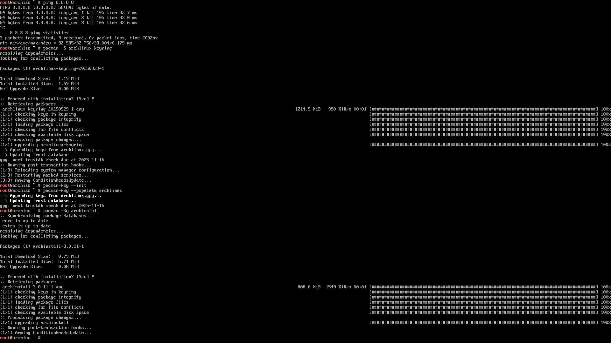

# Operating Systems. Part 3 — “Installing Arch Linux” 🚀

In the previous episodes we conjured a USB with Arch (or a full **Ventoy** multi‑boot) and poked a bit of fun at the “GUI‑only” cult 😏

Time to install the **best OS of all time**, made by humans for humans. Yep, I mean **Arch** 🖤🐧

---

## 🧭 Plan

1. Prepare the media and check the network.
2. Update `archinstall` in the live environment (it’s often outdated on the ISO).
3. Walk through the installer: disks, btrfs, bootloader, profile, packages.
4. Reboot and make **GRUB** see Windows.

Along the way — screenshots and author commentary, with my signature grumbling here and there 🙃

---

## 🖥️ Preparation

1. **Write the Arch Linux ISO** with **archinstall**. I’m using Ventoy with a bunch of ISOs (and yeah, two pieces of junk — Windows 10 and 11 — are lying nearby; useful for dual‑boot).

2. **If you need dual‑boot**, install Windows first — fewer headaches.

3. In Windows, open **Disk Management** and **shrink** a partition to free space for Arch. If Arch goes to a **separate SSD**, just leave it empty.

      

4. **Windows must be GPT (not MBR)!** If you’re on MBR — convert to GPT:

      ```powershell
      mbr2gpt /convert /allowFullOS
      ```

5. **Check BitLocker / Device Encryption.** Either disable it, or write down the 48‑digit recovery key and keep it handy (like on paper). Otherwise there’s a good chance the bootloader gets locked after installing Arch 🤡

6. **Boot from the USB**: pick the USB device in BIOS/UEFI → land in the live environment.

      

7. **archinstall** is the official semi‑automated installer for Arch. Sure, you can do it the “proper” manual way — even **with a single command** — but I’m not a masochist (though after >10 installs, the temptation is real).

8. **Check the network**:

      ```bash
      ping -c 3 8.8.8.8
      ```

      If wired works — nice. For Wi‑Fi, hook up via `iwctl`:

      ```bash
      iwctl
      station wlan0 scan
      station wlan0 get-networks
      station wlan0 connect "MyWiFi" --passphrase "supersecret"
      exit
      ```

      

9. **pacman keys (just in case)** — initialize and populate:

      ```bash
      pacman -S archlinux-keyring
      pacman-key --init
      pacman-key --populate archlinux
      ```

      Without valid keys, packages won’t install. No packages — no joy 🙂

      

10. **Update archinstall** (the ISO version is often ancient):

      ```bash
      pacman -Sy archinstall
      ```

      Old versions love to pull non‑existent packages — and you learn that **at the very end** of install. Who needs that? 😑

      

11. **Start the installer**:

      ```bash
      archinstall
      ```

      

---

## ⚙️ Installation with archinstall

1. **Installer language** — keep English.

2. **Locales** — for now, only `en_US.UTF-8`. We’ll add Russian after install.

      

3. **Mirrors** — pick a region close to you (I used to choose `/Russia`).

      

4. **Disk configuration** — this is where lives can be ruined. Scenarios:

      * **Arch only on the disk** → *Best‑effort default partitioning*.
      * **Two disks (Windows and Arch separate)** → choose the empty disk → *Best‑effort*.
      * **Single disk dual‑boot** → shrink Windows beforehand → in the installer use **free space** → *Manual Partitioning* → create the required partitions manually.

      For a btrfs setup:

      * `/boot` — **at least 1 GB** (not 100 MB, please!)
      * btrfs subvolumes:

         * `@`      → `/`
         * `@home`  → `/home`
         * `@log`   → `/var/log`
         * `@pkg`   → `/var/cache/pacman/pkg`
         * `@.snapshots` → `/.snapshots`

      

      The screenshot shows the empty Kingston SSD. Hit **Suggest partition layout**.

      

      **Filesystem: btrfs.** I’ve been on it for a long time and I’m happy. Theory and tuning will be a separate post. CoW is **disabled**.

      

      You’ll end up with something like this:

      

      > ⚠️ This is the trickiest step. It used to ruin installs for me or nuke Windows. Be attentive — read what the installer says.

5. **Disk encryption** — optional. I leave it off.

6. **Swap** — enable it. Detailed swap/hibernation tuning — later.

7. **Bootloader**:

      * If Arch is **the only OS** — use `systemd-boot`.
      * If it’s **dual‑boot** — **GRUB**, period. You *can* tweak `systemd-boot` for dual‑boot, but I’m not eager (burned a whole day — unsuccessfully 😅).

      

8. **Hostname** — anything pleasant. That’s your machine’s name on the network.

9. **Authentication** — set the **root password**, create a **regular user** and grant sudo (archinstall has an option for that). On Linux we work **as user**, and use privileges consciously.

      

10. **Profile** — your initial system selection:

      * **Desktop → Hyprland** (my choice).
      * **Polkit** or **seatd** — I pick **polkit**.
      * **Graphics driver** — *All open‑source* (light side of the Force).
      * **Greeter** — **ly** (minimalistic).

      

11. **Applications → Audio → PipeWire** — choose it, not `pulseaudio` (that one’s retired and used to act up for me).

      Bluetooth — optional, can be configured later.

12. **Kernels** — I prefer `linux-zen` over `linux`.

13. **Network configuration** — “Copy ISO network configuration to installation”. That’s why we checked internet early on.

14. **Additional packages** — I add `vim` to test (because of course).

15. **Timezone** — `UTC` is fine (we’ll align Windows/Arch time later).

16. **NTP (Automatic time sync)** — **Enabled**. Sometimes networks act up and NTP fails — I never figured out why. Try a different Wi‑Fi if needed.

17. **Install → Yes** and pray to Linus Torvalds.

      The disk will be formatted, packages will fly by. Took me **10–30 minutes** depending on bandwidth and SSD.

18. If something **crashes** (and `archinstall` is Python, so it happens), **read the logs** — the installer will offer a command to upload logs and give you a link. Open it in a browser and analyze.

19. **Done!** You can chroot into the installed system right from the installer, drop back to live, or simply **reboot**. UEFI will have a **UEFI OS** entry — pick that.

      

---

## 🧰 After reboot: fix GRUB and Windows

1. Boot up. You see **GRUB**, but only **Arch** in the menu. Okay, let’s fix it.

2. Log in (ly → user/password). You’ll land in default **Hyprland**. At the top — a bunch of config errors… it’s fine, we’ll sort it out in the next part. For now, the goal is to bring Windows back to the GRUB menu.

3. Update the system (just in case):

      ```bash
      sudo pacman -Syu
      ```

4. Install and configure **os-prober**:

      ```bash
      sudo pacman -S os-prober
      sudo os-prober                 # verify it detects Windows
      sudo sed -i 's/^#\?GRUB_DISABLE_OS_PROBER=.*/GRUB_DISABLE_OS_PROBER=false/' /etc/default/grub
      sudo grub-mkconfig -o /boot/grub/grub.cfg
      ```

      Here it should pick up the Windows bootloader.

5. Reboot:

      ```bash
      sudo reboot now
      ```

      Check **GRUB** — choose Windows. If it starts — victory 🎉

---

## Result

With **archinstall**, the setup goes briskly and without voodoo — as long as you’re careful with disks and the bootloader. This guide comes after **~10 Arch installs** 😅 (too much pain to fit here) — there were plenty of hiccups, but now you’ve got a **beaten path** to follow.

I’ve tried Debian, ElementaryOS, Fedora (meh), Ubuntu (meh ×2), i3, GNOME (nope), KDE (also nope). I settled on **Arch + Hyprland (via HyDE)** — the simplest and most convenient **for me**. I’m planning to try **NixOS** (brain‑melter) and **CacheOS** (Arch‑based).

**Thanks for reading! May Arch be with you!** ✌️ :3

---

### Next up

In the **next article**: **post‑install Arch Linux setup** — software, Hyprland, fonts, layouts, dotfiles.
