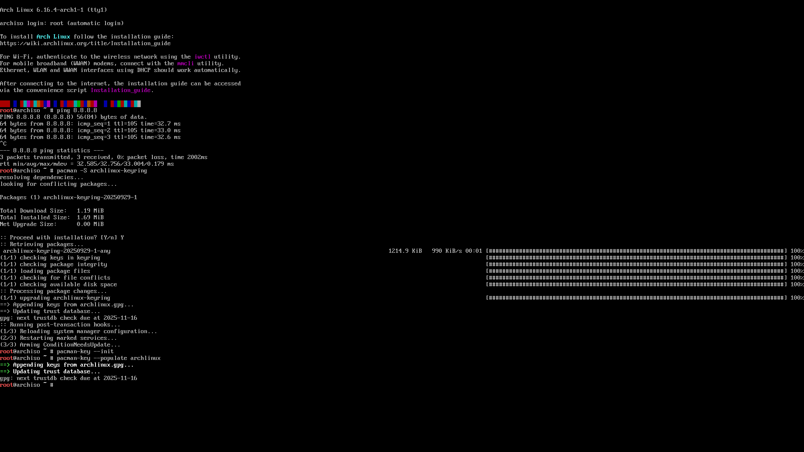
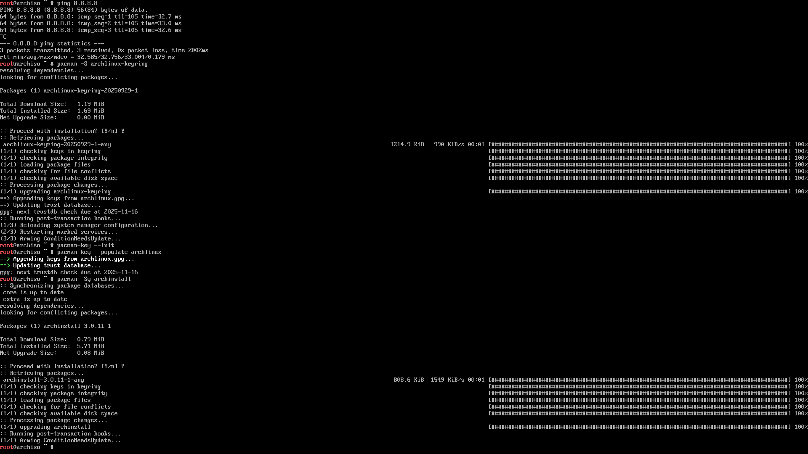
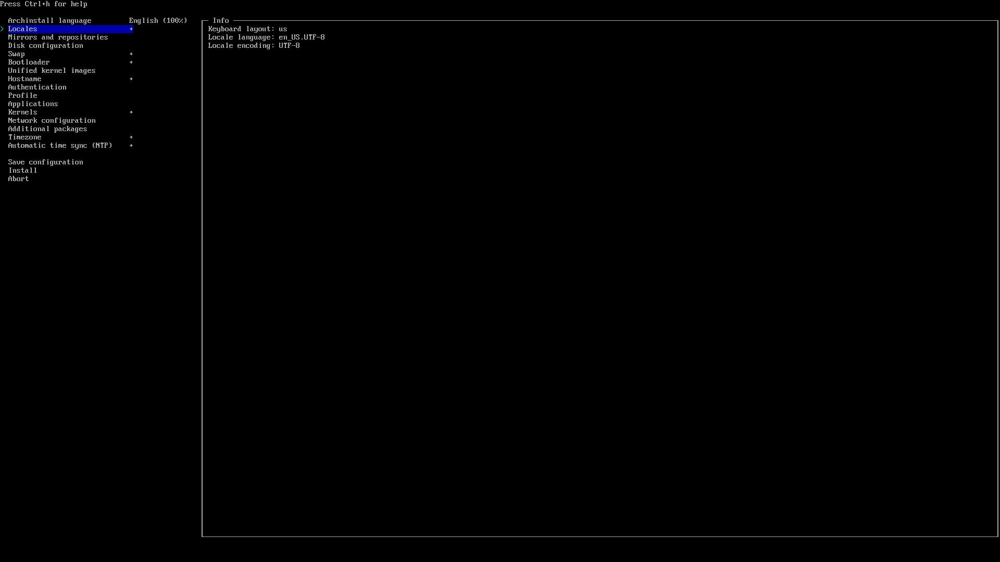
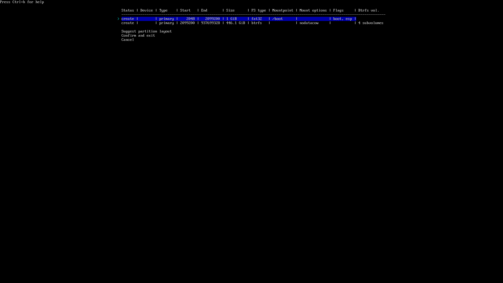
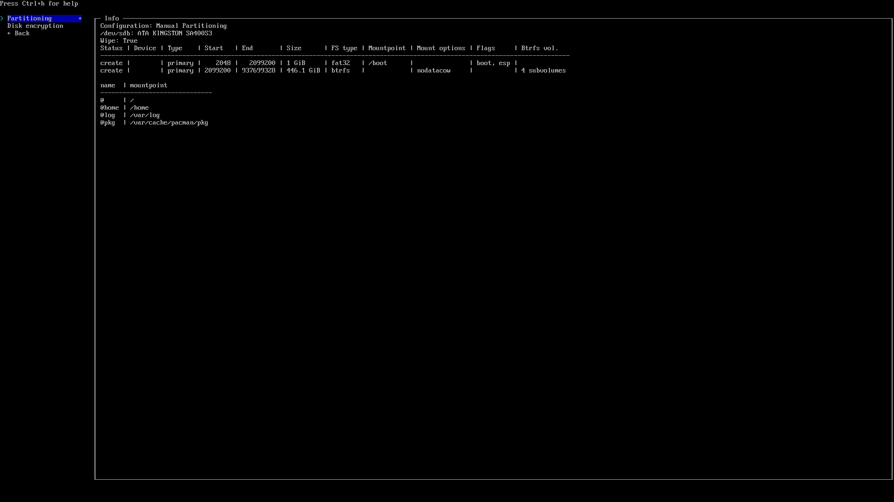
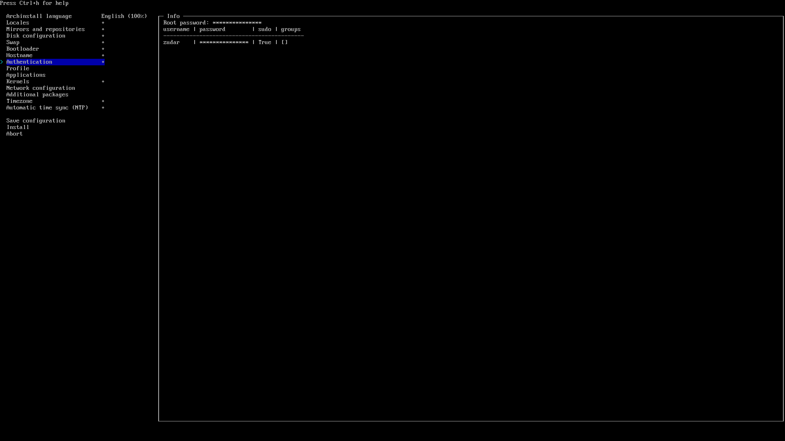
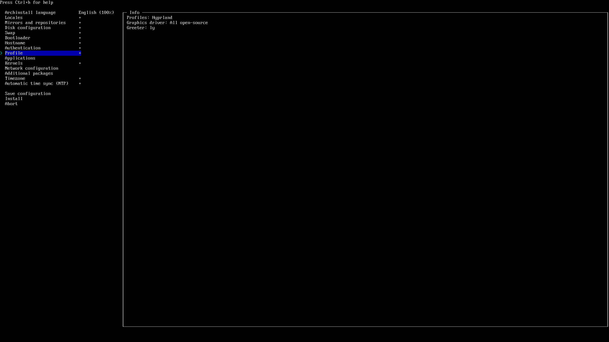
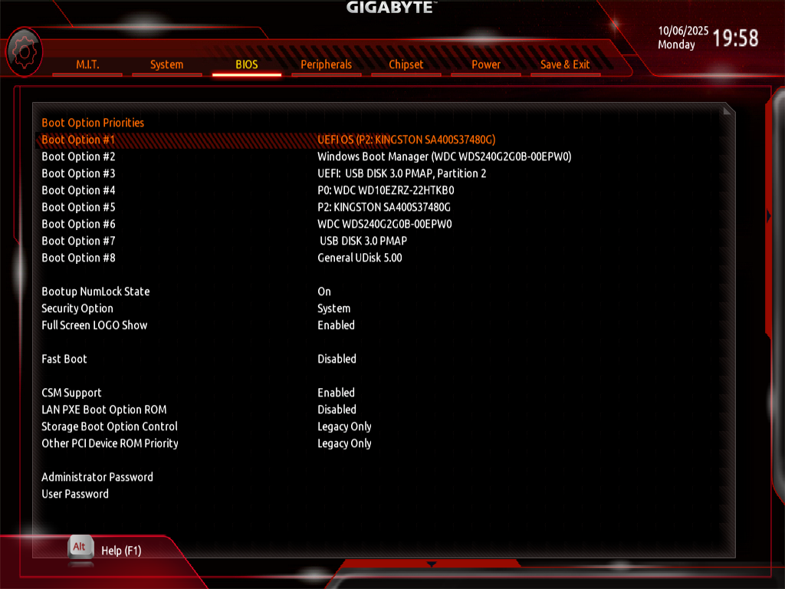

# Операционные системы. Часть 3 — «Установка Arch Linux» 🚀

В прошлых сериях мы уже наколдовали флешку с Arch (или целый **Ventoy**‑мультизагруз) и слегка потроллили культ «только GUI» 😏

Самое время поставить **лучшую ОС всех времён и народов**, сделанную людьми для людей. Да, я про **Arch** 🖤🐧


---

## 🧭 План действий

1. Подготовим носитель и проверим сеть.
2. Обновим `archinstall` в live‑среде (на флешке он часто старый).
3. Пройдём установщик: диски, btrfs, загрузчик, профиль, пакеты.
4. Перезагрузимся и доведём **GRUB** до ума (чтоб видела «винду»).

По пути — скриншоты и комментарии автора, местами с фирменным ворчанием 🙃

---

## 🖥️ Подготовка

1. **Записываем ISO Arch Linux** с **archinstall**. У меня — Ventoy с набором ISO (и да, рядом валяются две помойки: Windows 10 и Windows 11 — пригодятся для дуалбута).

2. **Если нужен дуалбут**, сначала ставим Windows — так меньше геморроя.

3. В Windows открываем **Disk Management** и **сжимаем** раздел, чтобы освободить место под Arch. Если Arch пойдёт на **отдельный SSD** — просто оставляем его пустым.

      

4. **Windows должна быть в GPT (не MBR)!** Если у тебя MBR — конверти в GPT:

      ```powershell
      mbr2gpt /convert /allowFullOS
      ```

5. **Проверь BitLocker / Device Encryption.** Либо отключи, либо выпиши 48‑значный ключ восстановления и положи в карман (прямо физически — на бумажку). Иначе велика вероятность встретить блокировку загрузчика после установки Arch 🤡

6. **Грузимся с флешки**: в BIOS/UEFI выбираем USB‑носитель → попадаем в live‑среду.

      

7. **archinstall** — официальный полуавтоматический установщик Arch. Да, можно и «по‑взрослому» руками, и даже **одной командой**… но я не мазохист (хотя после >10 установок есть соблазн, не скрою).

8. **Проверяем интернет**:

      ```bash
      ping -c 3 8.8.8.8
      ```

      Если по проводу всё ок — кайф. Если Wi‑Fi — цепляемся через `iwctl`.

      ```bash
      iwctl
      station wlan0 scan
      station wlan0 get-networks
      station wlan0 connect "MyWiFi" --passphrase "supersecret"
      exit
      ```

      

9. **Ключи pacman (на всякий случай)** — инициализация и наполнение:

      ```bash
      pacman -Sy archlinux-keyring
      pacman-key --init
      pacman-key --populate archlinux
      ```

      Без живых ключей пакеты ставиться не будут. Не будет пакетов — не будет счастья 🙂

      

10. **Обновляем archinstall** (на ISO он часто древний):

      ```bash
      pacman -Sy archinstall
      ```

      Старые версии любят тянуть несуществующие пакеты — и узнаёшь об этом **в самом конце** установки. И кому это надо? 😑

      

11. **Стартуем установщик**:

      ```bash
      archinstall
      ```

      

---

## ⚙️ Установка через archinstall

1. **Язык интерфейса** — оставляем English.

2. **Locales** — пока только `en_US.UTF-8`. Русский добавим после установки.

      

3. **Mirrors** — выбираем ближайший к тебе регион (у меня `/Russia`).

      

4. **Disk configuration** — тут можно и жизнь сломать. Сценарии:

      * **Только Arch на диске** → *Best‑effort default partitioning*.
      * **Два диска (Windows и Arch раздельно)** → выбираем пустой диск → *Best‑effort*.
      * **Один диск под дуалбут** → заранее ужимаем Windows → в установщике берём **free space** → *Manual Partitioning* → создаем обязательные разделы вручную.

      Для btrfs‑сетапа:

      * `/boot` — **минимум 1 GB** (не 100 МБ, прошу!)
      * Под btrfs — набор субтомов:

         * `@`      → `/`
         * `@home`  → `/home`
         * `@log`   → `/var/log`
         * `@pkg`   → `/var/cache/pacman/pkg`
         * `@.snapshots` → `/.snapshots`

      

      На скрине — тот самый свободный SSD Kingston. Жмём **Suggest partition layout**.

      

      **Файловая система: btrfs.** Я уже давно на ней и доволен. Теорию и тюнинг — в отдельной статье. CoW **отключаем**.

      

      В итоге получаем примерно так:

      

      > ⚠️ Это самый тонкий шаг. Раньше он мне руинил установку или сносил «винду». Будь внимателен — читай, что пишет инсталлятор.

5. **Шифрование диска** — по желанию. Я не включаю.

6. **Swap** — включаем. Детальный тюнинг свапа/hibernation — потом.

7. **Bootloader**:

      * Если Arch **единственный** — бери `systemd-boot`.
      * Если **дуалбут** — **GRUB** и только. `systemd-boot` в дуалбуте можно допилить, но я не горю желанием (целый день угрохал — безуспешно 😅).

      

8. **Hostname** — любое благозвучное. Это имя машины в сети.

9. **Authentication** — ставим **root‑пароль**, создаём **обычного пользователя** и даём ему sudo (в archinstall есть галка/опция). В Linux работаем **только** от юзера, привилегии — осознанно.

      

10. **Profile** — это стартовая сборка системы:

      * **Desktop → Hyprland** (мой выбор).
      * **Polkit** или **seatd** — беру **polkit**.
      * **Graphics driver** — *All open‑source* (мы на светлой стороне).
      * **Greeter** — **ly** (минималистично).

      

11. **Applications → Audio → PipeWire** — берём его, не `pulseaudio` (тот уже на пенсии, да и косячил у меня).

      Bluetooth — по желанию, можно и потом настроить.

12. **Kernels** — вместо `linux` я люблю `linux-zen`.

13. **Network configuration** — «Copy ISO network configuration to installation». Ради этого интернет проверяли в начале.

14. **Additional packages** — для проверки ставлю `vim` (ну а что, святое).

15. **Timezone** — ставим `/Europe/Moscow` (потом синхронизацию Windows/Arch настроим отдельно).

16. **NTP (Automatic time sync)** — **Enabled**. Иногда сети чудят, и NTP не проходит — так и не разобрался почему. Надо пробовать от другой Wi-Fi сети.

17. **Install → Yes** и молимся Линусу Торвальдсу.

      Диск форматнётся, побегут пакеты. У меня занимало **10–30 минут** — зависит от канала и SSD.

18. Если что‑то **крашнется** (а `archinstall` на Python, так что бывает), **читаем логи** — установщик предложит команду для выгрузки логов и даст ссылку. Открываем в браузере и анализируем.

19. **Готово!** Можно зайти в установленную систему сразу из инсталлятора, или выйти в live‑среду, или просто **перезагрузиться**. В UEFI появится запись **UEFI OS** — её и выбираем.

      

---

## 🧰 После перезагрузки: чиним GRUB и «винду»

1. Загружаемся. Видим **GRUB**, но в меню только **Arch**. Окей, пофиксим.

2. Входим в систему (ly → логин/пароль). Перед нами дефолтный **Hyprland**. Сверху — ворох ошибок конфига… нормально, разберёмся в следующей части. Сейчас главное — вернуть Windows в меню GRUB.

3. Обновим систему (на всякий случай):

      ```bash
      sudo pacman -Syu
      ```

4. Ставим и настраиваем **os-prober**:

      ```bash
      sudo pacman -S os-prober
      sudo os-prober                 # проверяем, что видит Windows
      sudo sed -i 's/^#\?GRUB_DISABLE_OS_PROBER=.*/GRUB_DISABLE_OS_PROBER=false/' /etc/default/grub
      sudo grub-mkconfig -o /boot/grub/grub.cfg
      ```

      Здесь он должен подтянуть загрузчик «винды».

5. Перезагружаемся:

      ```bash
      sudo reboot now
      ```

      Проверяем **GRUB** — выбираем Windows. Если стартует — победа 🎉

---

## Что в итоге

Через **archinstall** установка проходит бодро и без шаманства, если аккуратно с дисками и загрузчиком. Эта инструкция написана после **~10 установок Arch** 😅 (не уместить сюда всю боль, через которую я прошел) — косяков было много, но теперь у тебя есть **проторенная дорожка**.

Я перепробовал Debian, ElementaryOS, Fedora (фу), Ubuntu (фу ×2), i3, GNOME (говно), KDE (тоже говно). В итоге осел на **Arch + Hyprland (через HyDE)** — самое простое и удобное **для меня**. В планах попробовать **NixOS** (сложнааа) и **CacheOS** (Arch‑based).

**Всем спасибо за внимание! Добра и арча в дом!** ✌️ :3

---

### Дальше — больше

В **следующей статье**: **настройка Arch Linux** после установки — софт, Hyprland, шрифты, раскладки, конфиги
