# Operating Systems. Part 4 — “Arch Linux Setup” 🚀

In the previous part we installed **Arch Linux** via `archinstall` and successfully added **Windows** to **GRUB**. Now for the tasty part—polishing the system: time, Hyprland, apps, fonts, dotfiles, and other sorcery. There will be jokes, a tiny bit of toxicity, and lots of value. Let’s roll 😎

---

## 🧭 Plan of action

1. Make Windows respect UTC so Linux and Windows agree on time (who’s the clown here, anyway).
2. Clean up fresh Arch + Hyprland with **HyDE**.
3. Fix the **fish** shell and PATH if something went sideways.
4. Pull in my dotfiles (or your own) and sort out fonts.
5. Show a set of screenshots/bindings—so you don’t click blindly.
6. A quick list of base packages and “why you need them”.
7. Create **SSH** and **GPG** keys for GitHub.
8. A bit of update rituals and the final goodies.

---

## ⏱️ Time: make Windows respect UTC

By default, **Linux** assumes the hardware clock (**RTC/CMOS**) stores **UTC**, and local time = UTC + your timezone + DST. **Windows** lives in a parallel universe and assumes the RTC already holds **local time**. As a result, your clock “drifts” when rebooting.

> I believe **RTC should only store UTC**. Everything else is the OS’s job. So let’s nudge Windows.

Open **cmd.exe as Administrator** and run:

```bat
reg add "HKLM\SYSTEM\CurrentControlSet\Control\TimeZoneInformation" ^
    /v RealTimeIsUniversal /t REG_DWORD /d 1 /f

net stop w32time
net start w32time
w32tm /resync
```

Yes, we just poked the **Registry**. “Great design” (not), but it works. After this, Windows stops jumping around with the clock. Breathe evenly; proceed.

---

## 🧩 First boot into Arch + Hyprland (and a wall of warnings)

Boot into the installed Arch → log in → land in the default **Hyprland**. There will be warnings at the top—that’s fine, we’ll pretty things up now.

---

## 🌈 HyDE — a fast, pretty Wayland desktop on Hyprland

**HyDE** is a set of scripts/configs for quick, tidy setup: packages, themes (GTK/Qt), configs (SDDM, Waybar, etc.), NVIDIA fixes, GRUB/systemd‑boot integration. I like it—you suffer less and get a solid desktop fast.

> Repo: HyDE‑Project/HyDE. Supporting the folks is a noble cause.

### Installing HyDE

Open a terminal (**Super/Win + Q**) and run:

```bash
sudo pacman -S --needed git base-devel
git clone --depth 1 https://github.com/HyDE-Project/HyDE ~/HyDE
cd ~/HyDE/Scripts
./install.sh
```

During the script you’ll be asked a few questions. My answers / comments:

* **Chaotic AUR** — **don’t install** (wasn’t my cup of tea).
* AUR helper — I take **yay** (you can use `paru`).
* **Shell** — **fish** (zsh just doesn’t click for me, sorry).
* **Fonts** — you can start with `gnu-free-fonts` (we’ll add the missing ones later).
* **SDDM theme** — I pick *candy* (if you chose `ly` during install, it might stay `ly`).

!!!warning "Changing the shell may **interrupt** the install"
Sometimes the script crashes when switching shells: **fish** isn’t in `/etc/shells`. Fix it manually and rerun the installer.

```bash
echo /usr/bin/fish | sudo tee -a /etc/shells
chsh -s /usr/bin/fish
```

After changing the shell, **log out and back in** and run `./install.sh` again (and again if needed, until everything finishes). It’s usually better **not** to pull **Flatpak** apps from the installer to avoid dragging in a truckload of GNOME bits by accident. Later—add what you like.

### PATH after HyDE

Sometimes user scripts don’t end up in `PATH`. Add this for **fish**:

```fish
# add user binaries and hyde scripts (adjust the path on your setup)
set -U fish_user_paths $HOME/.local/bin $HOME/.local/lib/hyde $fish_user_paths
```

> Replace `$HOME/.local/lib/hyde` with the actual path if yours is different.

---

## 🖼️ Screenshots (so you know what “good” looks like)

> HyDE makes screenshots easy. A default system after running the HyDE script looks like this:


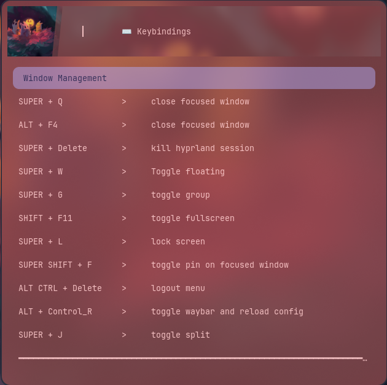
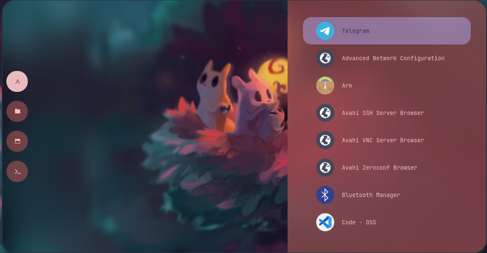
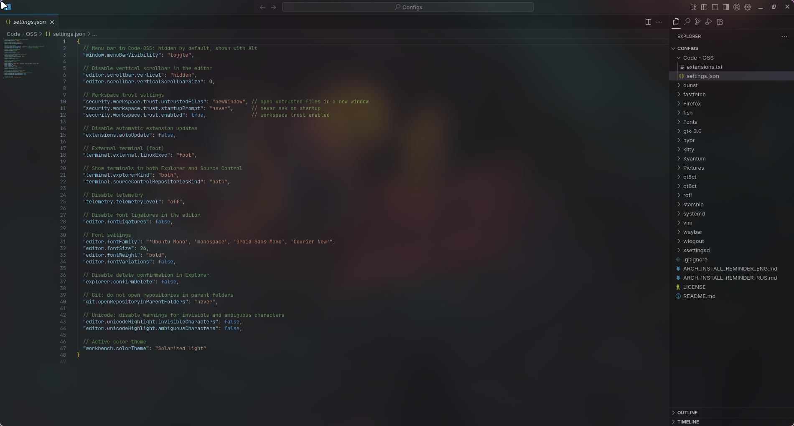

---

## 📦 Pull your configs (or mine)

Want to replace the defaults? First switch theme via **Cmd + Shift + T**.

I’ve got a config repo: take it wholesale or cherry‑pick.
Repo: zudaR107/Configs

```bash
mkdir -p ~/Sandbox
cd ~/Sandbox
git clone https://github.com/zudaR107/Configs
```

**Important:** app configs live in **`~/.config`**. Before copying, **inspect the contents** and tweak to taste—I tried to comment where needed.

### 🅰️ Fonts (system‑wide)

```bash
# 1) place fonts (ttf/otf/ttc, subfolders are fine)
sudo mkdir -p /usr/local/share/fonts/custom
sudo rsync -av --delete ~/path/to/repo/Fonts/ /usr/local/share/fonts/custom/

# 2) permissions
sudo find /usr/local/share/fonts/custom -type d -exec chmod 755 {} \;
sudo find /usr/local/share/fonts/custom -type f -exec chmod 644 {} \;

# 3) refresh cache
sudo fc-cache -f -v
```

### ⚙️ Code – OSS

1. Open **Settings** → bring over settings from my repo.
2. Install extensions from the `extensions` list.

It’ll be pretty and comfy—Promise™ ✨

### More configs (TL;DR what they are)

* **dunst** — lightweight notifications daemon (X11/Wayland). Copy `dunstrc`.
* **fastfetch** — a turbo‑charged “neofetch”. Copy `config.jsonc` and `logo/Avatar.jpg`.
* **fish** — pleasant interactive shell. Configs in `~/.config/fish`.
* **gtk-3.0** — GTK3 themes/icons/fonts.
* **hypr** — Hyprland configs.
* **kitty** — fast GPU terminal.
* **qt5ct / qt6ct** — set themes/fonts for Qt5/Qt6 outside KDE.
* **starship** — fast cross‑platform prompt (TOML config).
* **waybar** — status bar for Wayland.
* **wlogout** — sleek logout / sleep / reboot menu.
* **Firefox** — profiles / settings / extensions — as you wish.

After copying configs **reboot** (sometimes twice—Wayland “loves” stability… sometimes).

---

And here’s my “candy bar” setup:


*Desktop*

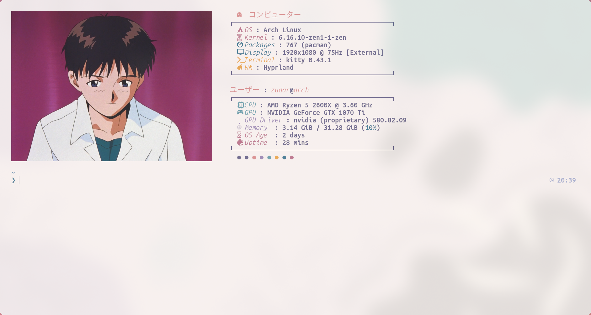
*Console*

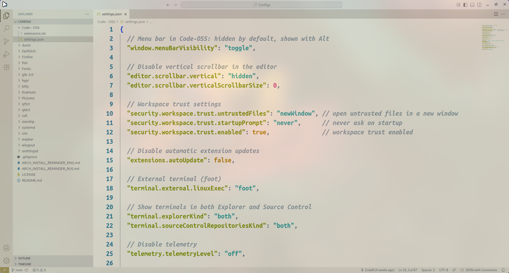
*Code OSS*

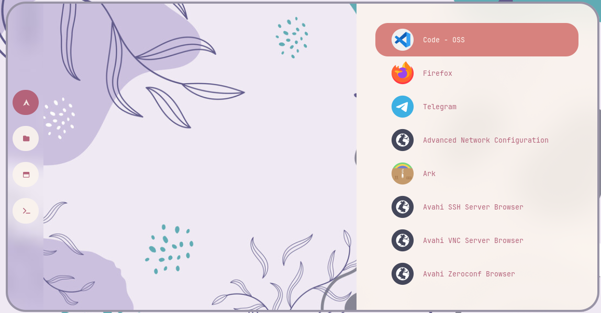
*Rofi app launcher*

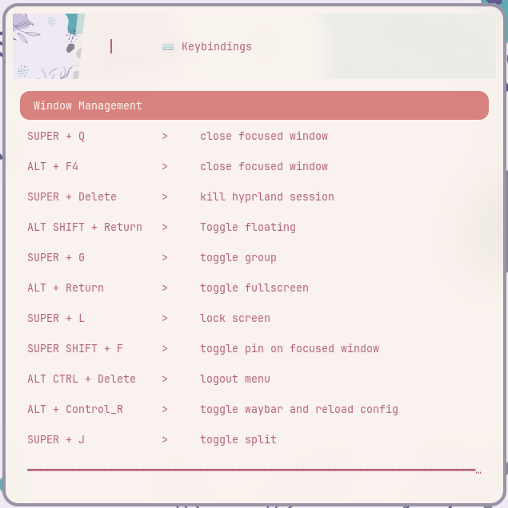
*Keybindings*

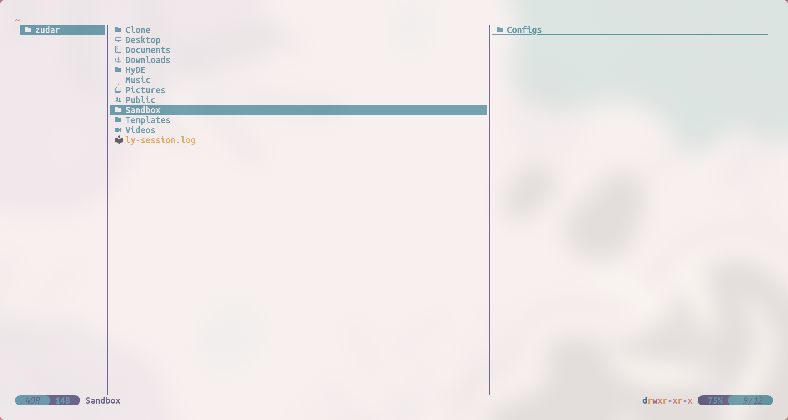
*Yazi — TUI file manager*

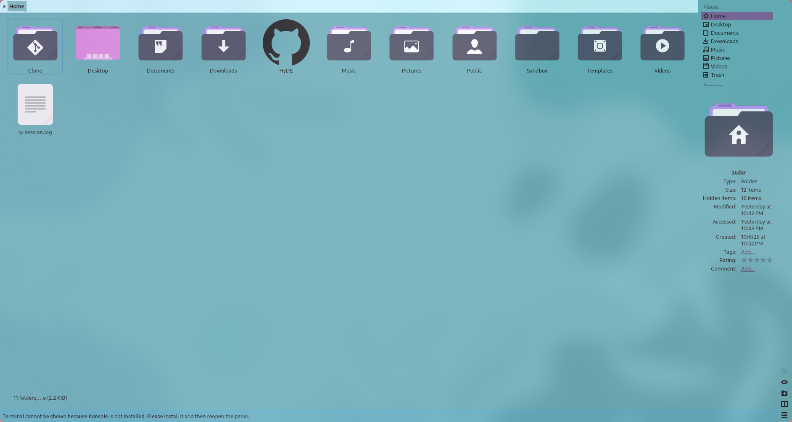
*Dolphin — GUI file manager*

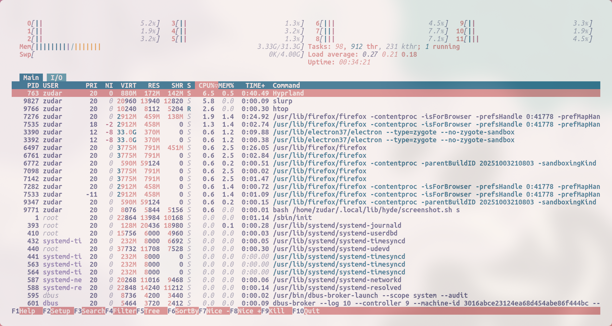
*Resource usage (htop)*

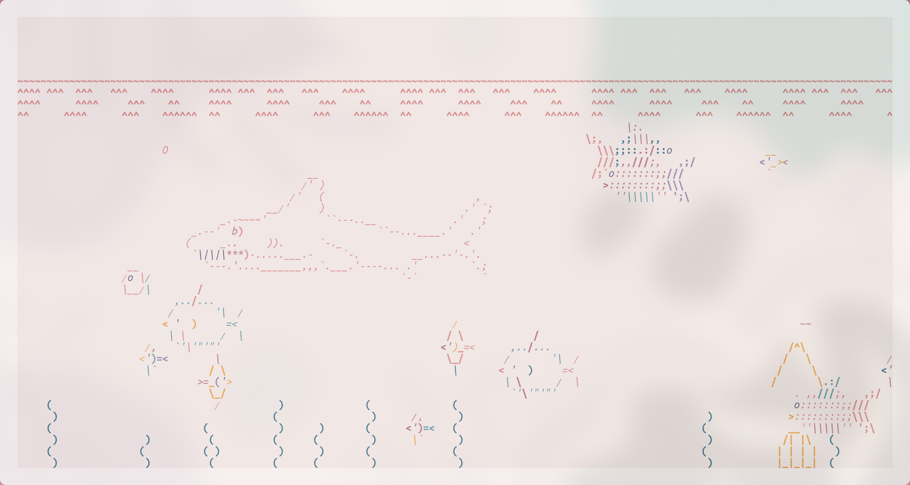
*Aquarium with fish*

(the last one is a silly flex, but cute 🐟)

---

## ⌨️ Hyprland — must‑know hotkeys

> **Cmd** = Win/Meta; **MB1/MB2** = left/right mouse buttons.

### Windows

* **Cmd + Q** / **Alt + F4** — close window.
* **Alt + Enter** — fullscreen.
* **Alt + Shift + Enter** — toggle floating.
* **Cmd + J** — toggle split/container orientation.
* **Cmd + Delete** — exit Hyprland.

### Focus / move / resize

* **Cmd + ← / → / ↑ / ↓** — focus window left/right/up/down.
* **Cmd + Shift + ← / → / ↑ / ↓** — resize (−/+ 30px).
* **Cmd + Ctrl + Shift + ← / → / ↑ / ↓** — move window.
* **Cmd + MB1** — hold and drag window.
* **Cmd + MB2** — hold and resize window.

### Workspaces

* **Cmd + 1…0** — go to WS 1…10.
* **Cmd + Shift + 1…0** — send window to WS 1…10.
* **Cmd + Ctrl + →/←** — next/previous workspace.
* **Cmd + S** — show/hide scratchpad.

### App launchers

* **Cmd + Enter** — terminal (`kitty`).
* **Cmd + E** — file manager yazi (mine: `kitty` + `fish` command).
* **Cmd + C** — editor (`code`).
* **Cmd + W** — browser (`firefox`).
* **Cmd + Space** — app search (rofi).
* **Cmd + Tab** — window switcher (rofi).

### Screenshots

* **Cmd + P** — select area.
* **Cmd + Ctrl + P** — “freeze” screen and select.
* **Cmd + Alt + P** — current monitor.
* **Print** — all monitors.

### Audio and brightness

* **F10 / XF86AudioMute** — mute.
* **F11 / XF86AudioLowerVolume** — volume down.
* **F12 / XF86AudioRaiseVolume** — volume up.
* **XF86AudioMicMute** — mic mute.
* **XF86MonBrightnessUp/Down** — brightness.

### Useful

* **Cmd + L** — lock screen.
* **Ctrl + Alt + Delete** — logout menu.
* **Alt + K** — switch keyboard layout.

---

## 🧺 Base packages: what to install and why

> The example below shows installing from official repos. Swap the package name as needed—same idea.

```bash
sudo pacman -S zip
```

Short notes:

* **zip / unzip** — ZIP archives (`zip`, `unzip`).
* **unarchiver** — `unar` / `lsar` for tons of formats (RAR / 7z / tar‑xz, etc.).
* **pwgen** — password generator in the terminal.
* **onlyoffice** — office suite. From AUR people often use `onlyoffice-bin`.
* **jlink** — SEGGER J‑Link tools (flash / debug ARM).
* **cmake** — project generator / build system.
* **qmicroz** — “Zip/qmicroz” library for QtCreator (to work with archives) — **build from source**, author’s repo: artemvlas/qmicroz
* **less** — pager. Git whines without it.
* **gnupg** — GPG (sign/encrypt),
* **pinentry-gtk** or **pinentry-qt** — GPG passphrase input.
* **stm32cubemx** — grab from **ST’s official website**.
* **“three‑letter apps”** — get from the site, via proxy, as usual 🙃

Useful commands:

```bash
# is a package installed?
pacman -Q zip

# search repos
pacman -Ss unarchiver

# binary versions (if in PATH)
unar -v || true
cmake --version || true
```

---

## 🔑 SSH and 🔏 GPG for GitHub

### SSH (fish‑friendly)

In **fish** sometimes there’s no `hostname` (depends on packages). Let’s take a reliable route:

```fish
# 1) comment for the key: host + year
set -l HOSTNAME_SAFE (cat /etc/hostname 2>/dev/null; or uname -n)
set -l COMMENT "github-$HOSTNAME_SAFE-"(date +%Y)

# 2) generate key
ssh-keygen -t ed25519 -C "$COMMENT" -f ~/.ssh/id_ed25519_github

# 3) agent + add key to the session
eval (ssh-agent -c)
ssh-add ~/.ssh/id_ed25519_github

# 4) ssh config for GitHub
mkdir -p ~/.ssh && chmod 700 ~/.ssh
printf 'Host github.com\n  HostName github.com\n  User git\n  IdentityFile %s\n  IdentitiesOnly yes\n  AddKeysToAgent yes\n' ~/.ssh/id_ed25519_github >> ~/.ssh/config
chmod 600 ~/.ssh/config

# 5) show the public key (copy to GitHub → Settings → SSH and GPG keys)
cat ~/.ssh/id_ed25519_github.pub

# 6) test the connection
ssh -T git@github.com
```

### GPG

```bash
sudo pacman -S gnupg pinentry-gtk   # or pinentry-qt

# 1) quick Ed25519 key (sign‑only), validity 1 year (0 = no expiry)
gpg --quick-generate-key "Your Name <you@example.com>" ed25519 sign 1y

# 2) find KEYID
gpg --list-secret-keys --keyid-format=long

# 3) export the public key (paste into GitHub → New GPG key)
gpg --armor --export YYYYYYYYYYYYYYYY

# 4) configure git
git config --global user.name  "Your Name"
git config --global user.email "you@example.com"
git config --global user.signingkey YYYYYYYYYYYYYYYY
git config --global commit.gpgsign true
git config --global tag.gpgSign    true
git config --global gpg.program gpg
```

---

## 🔄 Updates and the final touch

Update the system (and do it **regularly**, yes):

```bash
sudo pacman -Syu
```

!!!warning "Rolling‑release is not a joke"
Arch and Hyprland get frequent updates. Sometimes pain arrives. Options: install an **LTS kernel**, update less often (risk piling up issues), or—the better path—**fix problems as they appear**. Also: read news / changelogs.

---

## 🏁 What we achieved

We tamed the clock (UTC for the win), rolled out **HyDE**, fixed the shell / `PATH`, migrated configs, set up fonts and hotkeys, and installed base software. We also prepared **SSH/GPG** for committing into a bright future 🖤

The first time may take **1–2 full days** (been there). Now it takes me ~**3 hours** for a clean setup. Don’t fear **Arch**—and it will love you back! 🐧✨

Next up: a series of **theory** articles on OS fundamentals (and beyond). Stay tuned 😉
