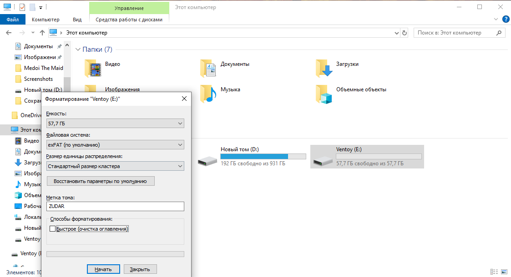

# Operating Systems. Part 1 — “Bootable USB” 🚀

So, we want to install an OS (you know which one, right? 😏).

## Plan

1. **Plug in a USB drive** that will become our boot device.

      ⚠️ Heads‑up: it will be **wiped**. Honestly, keep a bunch of USB sticks around. I’ve got six, for example 🙂

2. **Format the USB drive.**

      

      As you can see — that’s Windows. Which makes sense, because the desire to install another OS usually appears **while using this piece of junk** 💩

      > Note: Rufus will format the drive anyway before writing, so you can skip this step. But I enjoy deleting data, so I gladly format it a couple more times. Mmm 😈

3. **Download the Arch Linux ISO** (what else would we use? 😎).

      Head to 👉 [https://archlinux.org/download/](https://archlinux.org/download/)

      Remember this site and the **Arch Wiki** — you’ll need them **a lot** 🔥

4. **Pick a mirror and a download method.**

      If you want a direct HTTPS link — choose a mirror on the downloads page. For Russia, for example, there’s:
      👉 [https://archlinux.gay/archlinux/iso/latest/](https://archlinux.gay/archlinux/iso/latest/)
      Or just pick any mirror that’s physically close to you — it’ll be faster. The key point: always grab the **latest** release, or you can run into package issues. The link above points to the latest build.

5. **Install Rufus.**

      Go to 👉 [https://rufus.ie/](https://rufus.ie/)
      Download it. Rufus is a utility for formatting and creating bootable USBs, SD cards, etc.

6. **Create a bootable USB with Rufus.**

      

      In Rufus, select:

      * **Device:** your USB drive.

      * **Boot selection:** the Arch ISO you downloaded.

      * **Partition scheme:**

         * **GPT** — if you have **UEFI** (modern PCs/laptops).
         * **MBR** — if you have **Legacy BIOS** or **CSM** enabled.

      * **File system:** FAT32 (works for the Arch ISO).

      * Hit **Start** and wait patiently. Rufus will prep and format everything for you ✅

      I’ve been burned before, so I pick **GPT**. Sure — for a bootable thumb drive **MBR** can also work on older BIOS machines. The choice depends on your firmware. I’ll rant about theory later; for now, blind pick is fine — but better aim for UEFI 😉

7. **Check the contents of the USB.**

      

      That’s it — the stick is ready. I used to go with **MBR**, but now let’s verify **GPT** — let’s be grown‑ups.

8. **Reboot and enter BIOS/UEFI.**

      Mash ESC / F2 / F8 / F10 / F12 / Del — depends on the vendor. Choose the USB drive in the boot menu.

      If you made **GPT + UEFI** — **disable CSM** (Legacy/Compatibility Support) to boot pure UEFI.
      If you made **MBR** — the opposite, **enable CSM/Legacy**.

      

      Some firmware can save screenshots (often **F12**) to a second inserted USB — handy for guides like this.

9. **Boot into the Arch Linux live environment.**

      

      The installer shows up — nice! The actual installation will be in one of the next posts 🎯

---

Now we have a **bootable USB** you can sneak into your colleague’s PC while they’re out for lunch 🙂
Imagine how happy they’ll be to escape the Windows GUI prison! 😜
