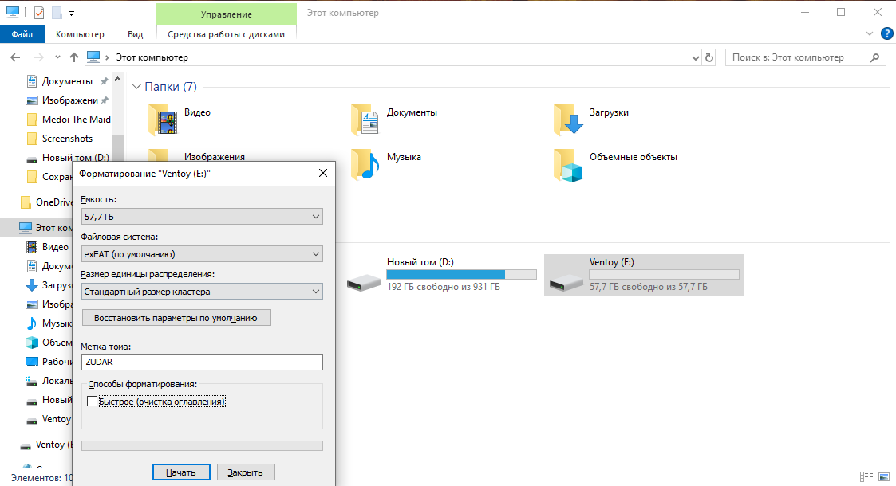
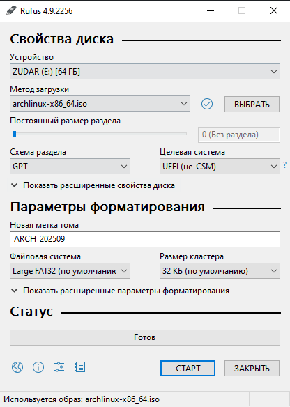
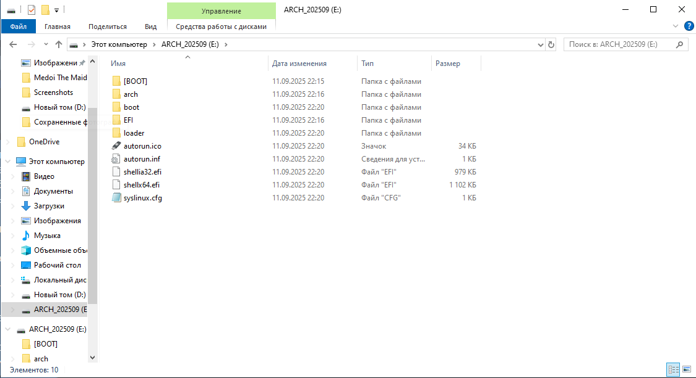
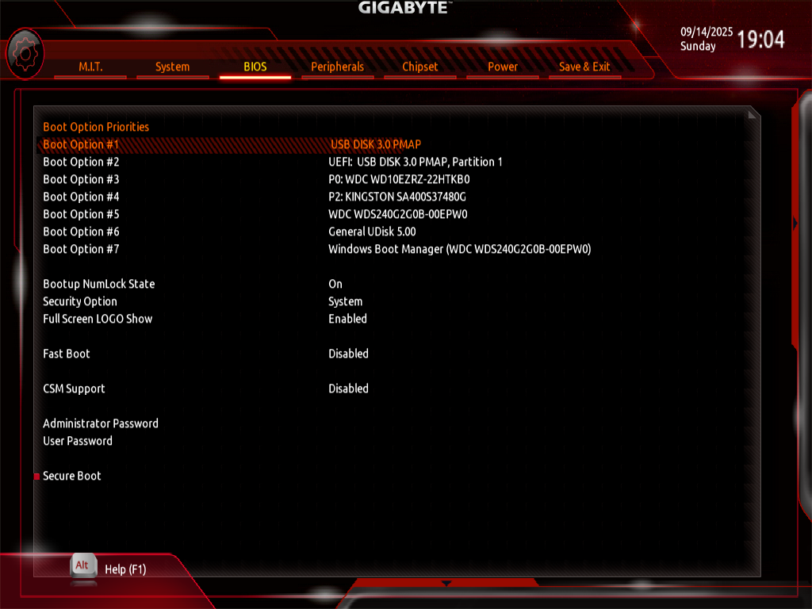
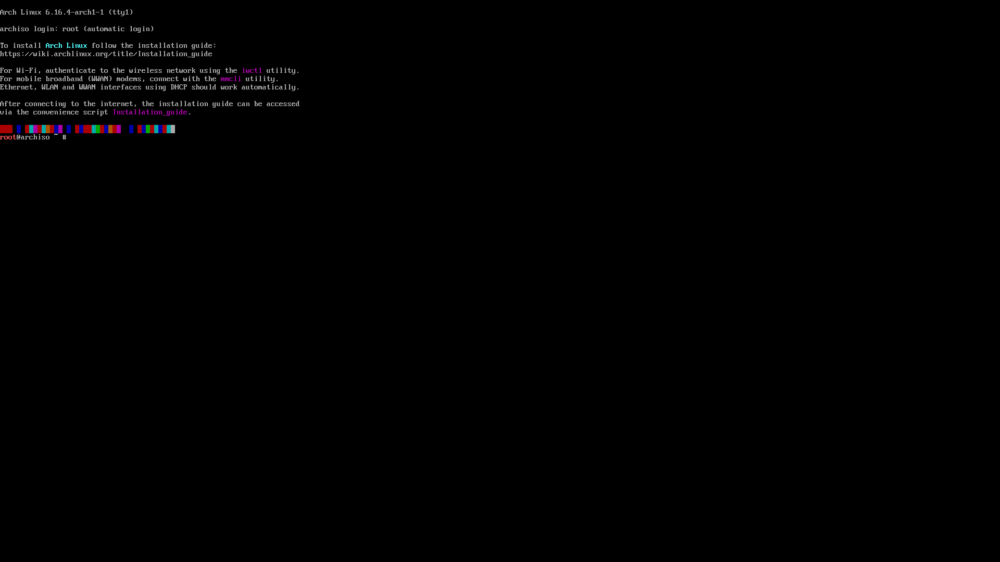

# Операционные системы. Часть 1 — «Загрузочная флешка» 🚀

Итак, мы хотим поставить себе какую-либо ОС (ну поняли, да, какую 😏).

## План действий

1. **Втыкаем флешку**, которая в дальнейшем будет выступать в роли загрузочного устройства.
    
    ⚠️ Осторожно: всё с неё сотрётся. Вообще, имейте побольше флешек. У меня их шесть, например 🙂

2. **Форматируем флешку.**
    
    

    Как можно заметить — интерфейс винды. Ну это потому, что желание поставить другую ОС возникает только при использовании этого куска говна 💩

    > Примечание: Rufus всё равно форматирует флешку перед записью, так что этот шаг можно пропустить. Но я люблю удалять данные, поэтому форматирую с удовольствием несколько раз. Ммм 😈

3. **Качаем ISO-шник Arch Linux** (ну а что ещё? 😎).
    
    Топаем на 👉 [https://archlinux.org/download/](https://archlinux.org/download/)

    Запомните этот сайт и **Arch Wiki** — ОЧЕНЬ часто пригодится 🔥

4. **Выбираем зеркало и способ скачивания.**
    
    Если хотите по прямой ссылке HTTPS — выбирайте зеркало на странице загрузки. Для России, например, есть:  
    👉 [https://archlinux.gay/archlinux/iso/latest/](https://archlinux.gay/archlinux/iso/latest/)  
    Или берите любое ближайшее к вам зеркало — быстрее качается. Красота! Главное: всегда ставьте **последний** релиз, потому что иначе могут быть проблемы с пакетами. Ссылку я представил именно на latest-версию.

5. **Ставим Rufus.**
    
    Идём на 👉 [https://rufus.ie/](https://rufus.ie/)  
    Скачиваем. Rufus — это утилита для форматирования и создания загрузочных флешек, карт памяти и т.д.

6. **Делаем загрузочную флешку в Rufus.**
    
    

    В окне Rufus выбираем:

    * **Устройство (Device):** вашу флешку.
    * **Выбор загрузки (Boot selection):** указываем скачанный ISO Arch.
    * **Схема раздела (Partition scheme):**
        
        * **GPT** — если у вас **UEFI** (современные ПК/ноуты).
        * **MBR** — если у вас **Legacy BIOS** или включён **CSM**.

        
    * **Файловая система:** FAT32 (подходит для Arch ISO).
    * Жмём **Start** и терпеливо ждём. Rufus сам всё подготовит и отформатирует ✅

    Я УЖЕ НАУЧЕН ГОРЬКИМ ОПЫТОМ, поэтому выбираю **GPT**. Хотя да — для загрузочной флешки подойдёт и **MBR**, если у вас старый BIOS. Выбор зависит от прошивки вашего железа. Теоретический пост будет позже, а пока — пальцем в небо, но лучше в UEFI 😉

7. **Проверяем содержимое флешки.**
    
    

    Вот и всё, флешка готова. Раньше я обычно делал **MBR**, но сейчас проверим **GPT** — пусть будет по-взрослому.

8. **Перезагружаемся и заходим в BIOS/UEFI.**
    
    Многократное нажатие на ESC / F2 / F8 / F10 / F12 / Del — у кого как. Выбираем флешку в меню загрузки.

    Если делали **GPT + UEFI** — **отключаем CSM** (Legacy/Compatibility Support), чтобы грузиться чисто в UEFI.  
    Если делали **MBR** — наоборот, **включаем CSM/Legacy**.

    

    Чтобы сделать скриншот в UEFI, используется карта захвата (нажимаем F12 и сохраняем на вторую вставленную флешку).

9. **Грузимся в лайв-режим Arch Linux.**
    
    

    Установщик запустился — отлично! Сама установка будет в одном из следующих постов 🎯

---

Теперь у нас готова **загрузочная флешечка**, которую можно воткнуть коллеге в комп, пока он ушёл на обед 🙂  
Как же он будет счастлив вырваться из этого виндусовского плена GUI-шного окружения! 😜
