# Operating Systems. Part 5 — “Installing and Setting Up CachyOS” ⚡

In the previous parts, we already managed to do two important things: first, we made a proper bootable **Ventoy** USB drive, and then we installed and configured **Arch Linux**. And sure, all of that is nice, all of it is “the proper way”… but then real life shows up, and you realize that sometimes you just want to **sit down and use your system** instead of heroically resolving yet another config conflict.

So today, instead of another ritual with “bare Arch,” we are going to look at **CachyOS** — an **Arch-based** distro that tries to be friendlier to normal human beings without turning into a pumpkin. Why did I decide to move to it? Because I got tired of fighting **HyDE**, fixing weird bugs, and repeatedly finding myself in the mood of “alright, just two more hours of tweaking and it’ll look perfect.” Enough. I chose happiness 😌

In this article, we are once again going through the whole journey **from ISO to a fully configured system**: installation, pitfalls, mirrors, bootloader, first launch, my configs, basic software, dual boot, fonts, SSH/GPG, and all the other little joys of grown-up Linux life.

This article promises to be packed. Very packed.

---

## 🧭 Plan of Attack

1. Download the **CachyOS ISO** and put it on a **Ventoy** drive.
2. Walk through the installer step by step without losing our minds.
3. Deal with the unpleasant part involving **mirrors** and `pacman`.
4. Pick a desktop environment and talk about why I chose **Niri**.
5. Do the initial post-install setup.
6. Apply my configs or repeat all steps manually.
7. Install the basic software, fonts, dev tools, and everything else needed for life.
8. Add **Windows to GRUB**, if you are running a dual-boot setup.
9. Get the system into that glorious state of “okay, now it’s actually beautiful **and usable**.”

---

## 💿 Downloading the ISO and putting it on Ventoy

As usual, we start from the [official **CachyOS** website](https://cachyos.org): download the **latest ISO image**. This matters. If you grab some ancient build, the installer will happily inform you that the world has moved on, packages have been relocated, mirrors have mutated, and you should really reconsider your life choices.

Once downloaded, just copy the ISO onto your **Ventoy** USB drive.


> This is exactly why I love Ventoy: you do not have to “flash” the USB drive from scratch every single time. You just drop the ISO there like a regular file and move on. Civilization does exist after all.

If the target drive is currently filled with old junk you no longer need, clean it the same way we did in the previous parts. I am not going to dwell on that here again.

---

## 🥾 Booting from the USB drive

From here, it is the usual routine:

1. Reboot the PC.
2. Enter **UEFI/BIOS**.
3. Move the USB drive to the top of the boot order.
4. Boot into the **CachyOS LiveISO**.

And here comes a tiny little celebration: instead of a sad console-only installer, we get an actual **GUI installer**.


Yes, hardcore Linux purists may begin coughing disapprovingly in the corner. But as I already said, **I chose happiness**. We already poked the console in Arch. We are allowed to level up.

---

## 🪞 Mirror problems: why the installation may suddenly go off the rails

Now for the unpleasant part.

During installation, **CachyOS** ranks mirrors — in other words, it tries to pick the fastest and closest ones. The idea itself is good. But in my case, the list consistently included problematic mirrors such as `archlinux.gay` and sometimes `yandex`, which were not reachable from my side. The result: `pacman` errors, wasted time, annoyance, and that eternal feeling of “why exactly now?”

To open a terminal in the LiveISO, press:

```bash
Ctrl + Alt + T
```


If you run into errors related to mirrors or `pacman` while preparing the system or during installation, you can try fixing the situation manually first.

### Re-rank the mirrors

```bash
sudo cachyos-rate-mirrors
```

### Search for problematic mirrors in the mirror list

```bash
sudo grep -RInE '(archlinux\.gay|yandex)' /etc/pacman.d | head
```

### Remove them from the lists

```bash
for f in /etc/pacman.d/mirrorlist /etc/pacman.d/*mirrorlist*; do
  [ -f "$f" ] || continue
  if sudo grep -qE '(archlinux\.gay|yandex)' "$f"; then
    echo "Cleaning: $f"
    sudo cp -a "$f" "$f.bak"
    sudo sed -i -E '/archlinux\.gay/d;/yandex/d' "$f"
    sudo grep -nE '(archlinux\.gay|yandex)' "$f" || echo "  -> OK (no matches)"
  fi
done
```

### Refresh package databases

```bash
sudo pacman -Syy
```

!!!warning "Important"
    This only helps for the **current Live session**. The installer itself may re-rank mirrors again and drag those problematic entries right back in.

    In my case, I ended up tunneling traffic through my own server just to make the whole thing behave. I am not going into the full circus here — everyone’s network, restrictions, and pain tolerance are different.

!!!note "UPD as of 2026-03-15"
    By the time I wrote this update, the issue had mostly stopped hitting me this hard, and installation usually worked even without the tunnel. Still, I am leaving this section in. Today it works, tomorrow it does not.

---

## 🛠️ Installing CachyOS — step by step

Now let’s go through the installer itself. I will show what **I** picked and comment along the way on where you should actually think a little and where it is perfectly safe to just hit “Next.”

### 1) System language

This time, I decided to install the system in **Russian** and see how well it handles that scenario. I had almost always used English before, but this time I felt like experimenting.

### 2) Launching the installer

Start the installer directly from the LiveISO.

### 3) Welcome screen

Choose your language.


### 4) Location

I picked **Europe → Moscow**. Naturally, you should choose **your own** timezone. The main thing here is understanding that this is simply regional formatting: dates, time, locale, and so on.


### 5) Keyboard

I also selected Russian here, but honestly, that did not completely save me: I still had to fix a few things manually later in the system config.


### 6) Bootloader

I choose **GRUB**.

Why:

* **GRUB** is old, familiar, and has survived a lot.
* I did try **systemd-boot**, but quickly realized that getting dual boot working properly through it, without unnecessary fuss, was not happening for me.
* The other options either do not interest me or I have not really used them.

The conclusion: **pick GRUB and live peacefully**.


### 7) Disk partitioning

I installed the system onto a **separate drive** that I had already cleaned beforehand. So this part was simple: select the drive, use **btrfs**, move on.

If you are installing **next to Windows on the same drive**, welcome to adulthood. You will most likely need **Manual partitioning**, and the developers themselves warn that automatic partitioning in this scenario may not work perfectly.

So if you are doing dual boot on a single drive, **do not rush**, double-check everything, and do not rely on “eh, it’ll probably be fine.” It might. But it also might not.


### 8) Choosing a Desktop Environment / Window Manager

This is where things get interesting.

There are lots of options. A lot.

* Want something old, solid, and time-tested? Go with **i3**.
* Want something nice and modern? Look toward the newer compositors.
* Want to suffer inside a rich interface? Oh yes, that option is available too 😏

My own choices looked like this:

* **i3** — I love it, I used it for a long time, I respect it. But it is still X11, and I wanted to move on for good.
* **Hyprland** — been there, done that, enough already. Beautiful, flashy, but in my case it too often meant untangling conflicts and chasing weird breakage.
* **KDE / XFCE / GNOME** — no holy war here, but honestly: **I just do not like the vibe**. Too heavy in places, too cluttered in places, and simply not pretty enough for me personally. If you like them, great. But I am writing about my own setup.

In the end, I settled on **Niri**.

### Why Niri

**Niri** is not just “yet another tiling window manager.” It is a **scrollable-tiling Wayland compositor** with a very pleasant workflow:

* windows live in columns;
* the workspace feels like it stretches horizontally;
* opening a new window does not cause chaos in the existing layout;
* navigation feels smooth and logical;
* the whole thing feels fresh and modern, without the sense that you are working inside a museum exhibit of window managers.

What I liked about it:

* **predictability** — windows do not jump around like they are possessed;
* **comfortable multi-window workflow** on a single workspace;
* **Wayland** without the immediate urge to go repair half the system;
* a nice balance between “minimalist” and “this is still usable every day.”

The downsides:

* it is not as familiar as i3;
* some things feel unusual at first if you are coming from classic tiling WMs;
* you will still need to read some configs and understand its philosophy.

But overall, Niri very quickly gave me that feeling of: **yes, this actually feels like a system I want to live with every day**.


### 9) Package selection

At this stage, you can check extra packages you want installed right away. I usually prefer adding some of them manually later so I have a clearer picture of what exactly ended up in the system.


### 10) User creation

Nothing unusual here: username, password, machine name, and so on.


### 11) Summary before installation

This screen is **absolutely worth reading carefully**. Yes, it is boring. Yes, you already want to click “Install.” But this is also where it is easiest to notice that you accidentally selected the wrong drive, the wrong bootloader, or the wrong keyboard layout.


### 12) The actual installation

If everything was configured correctly, the installer takes over from here.


If something fails, there is no magic trick: check the logs, read the errors, deal with the situation. Linux is not cured any other way. And yes, make sure to reboot before trying the installation again — the developers themselves recommend that.

### 13) Installation complete

For me, the installation took about **30 minutes**, but of course that depends on your internet speed, mirrors, the mood of the package manager, and the general alignment of the stars.


---

## 🚪 First boot into the new system

After installation:

1. Reboot.
2. Pick **GRUB** in UEFI.
3. Enter your shiny new system.

To be honest, it took me **several reboots** before everything worked exactly the way I wanted. So if it does not come together on the first try, that does not mean you are bad at this — it just means Linux is reminding you that free cheese only exists inside commands like `pacman -S`.

---

## 🎨 First-time setup after login

After the first login, you get the basic environment setup. In my case, it looked like this:

* enable telemetry — yes, I enabled it; let the poor open-source folks have at least some data;
* choose the wallpapers directory;
* configure the color theme;
* choose the look of the panel, dock, and other interface elements.

I went with the **light and warm Kanagawa theme**.


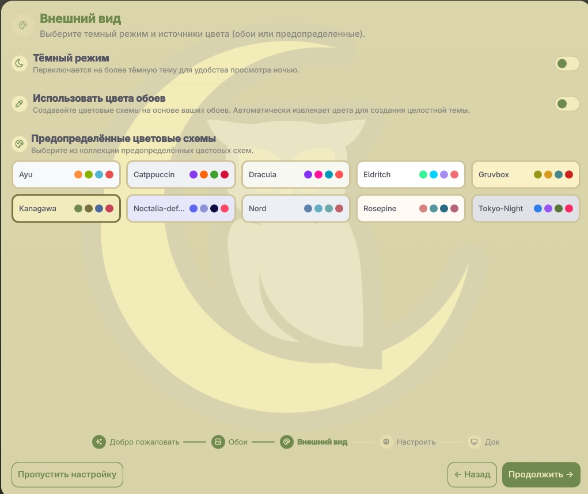


You can always change all of this later through the settings panel. But as usual, there is a faster path: **just grab my configs** and stop reinventing the bicycle, the square wheel, and a brand-new religion all at once.

---

## 📁 My CachyOS configs

I prepared a separate repository with my configs:

**[https://github.com/zudaR107/cachyos-configs](https://github.com/zudaR107/cachyos-configs)**

It already contains my system setup, plus a script for automatic installation and initial configuration.

### How to clone the repository

```bash
mkdir -p ~/Sandbox
cd ~/Sandbox
git clone https://github.com/zudaR107/cachyos-configs
cd cachyos-configs
```

### What the script can do

```bash
./scripts/install.sh --help
./scripts/install.sh --dry-run
./scripts/install.sh --backup-dir <path>
```

Where:

* `--help` — show help;
* `--dry-run` — see what would happen **without actually applying anything**;
* `--backup-dir <path>` — override the path where your current configs will be backed up before replacement.

!!!warning "Important"
    If something breaks, first try to understand and fix it yourself. Then let me know so I can improve the repo for the next people. Shared suffering is the foundation of open source.

---

## 🔧 If you want to configure everything manually

The script is convenient. But if you want to fully understand what is being changed and why, here are the core steps in a more manual form.

### 1) Update the system and refresh package databases

```bash
sudo pacman -Syu
```

If you need to **force-refresh the databases from scratch**, use:

```bash
sudo pacman -Syyu
```

Useful commands for everyday life:

```bash
sudo pacman -S <package_name>   # install a package
pacman -Ss <package_name>       # search repositories
yay <package_name>              # search/install via AUR
man <command>                   # documentation
<command> --help                # short help
```

> I try to update the system almost every day and I am no longer afraid of rolling release. Life got easier. The main thing is not to start updates at 3 AM right before important work. Although… who am I kidding.

### 2) Use CachyOS repositories when it makes sense

If a package exists in `cachyos-*`, it is often newer there than in the standard repositories. That does not mean “blindly install everything from there forever,” but it is definitely worth checking.

---

## 📦 My package list

This is not “the objectively best list for all humanity.” It is simply **my working set** — the one I use to live, code, poke at hardware, and not feel half-naked.

### Fonts and essentials

* **ttf-ubuntu-font-family** — the base Ubuntu fonts for a clean-looking system.
* **ttf-ubuntu-mono-nerd** — my favorite monospace font for the terminal, editor, and pretty prompt icons.
* **yay** — an AUR helper. You can technically survive without it on Arch-based systems, but why would you.
* **rsync** — proper copying and syncing of files and configs. Useful when you want to synchronize directories carefully instead of throwing `cp -a` at the problem and hoping for the best.

### Everyday software

* **telegram-desktop** — Telegram. No further comment needed.
* **onlyoffice-bin** — office suite. For those rare moments when documents still exist.
* **zip / unzip** — ZIP archives. Basic survival tools.
* **unarchiver** — `unar` / `lsar` for unpacking all sorts of exotic archive formats.
* **pwgen** — password generator.
* **tree** — display a pretty directory tree and briefly feel in control of your project.
* **fastfetch** — fast system summary in the terminal.
* **onefetch** — like fastfetch, but for git repositories.
* **wlsunset** — warmer screen tones in the evening. Your eyes will appreciate it.
* **cliphist** — clipboard history. Once you get used to it, going back feels wrong.
* **yazi** — a very pleasant terminal file manager.
* **ex-vi-compat** — small but useful compatibility with old `vi` habits.
* **neovim** — just in case you suddenly want to open something quickly and feel elite.

### Development and debugging

* **code** — a Code - OSS / VS Code-like editor. My main GUI editor.
* **qtcreator** — Qt Creator. Essential for C++/Qt work.
* **lldb** — debugger.
* **bear** — generates `compile_commands.json` for C/C++ projects.
* **arm-none-eabi-gcc** — ARM Cortex-M compiler.
* **arm-none-eabi-gdb** — GDB for ARM.
* **arm-none-eabi-binutils** — ARM binutils.
* **arm-none-eabi-newlib** — standard library for embedded builds.
* **picocom** — minimal terminal for COM/UART work.
* **openocd** — flashing and debugging microcontrollers.
* **stlink** — ST-Link tools.
* **jlink** — SEGGER J-Link tools.
* **stm32cubemx** — project generation and initialization for STM32.
* **stm32cubeprog** — STM32 flashing tool.
* **stm32cubeide** — ST’s IDE, for when you feel like living that way sometimes.

### Shell and security

* **gnupg** — GPG for signing commits.
* **pinentry** — password entry for GPG without pain.
* **starship** — a fast and pretty shell prompt.

### And this one too

* **___** — yeah, you get the idea 😏

---

## 🔤 Installing Ubuntu Mono fonts

If the fonts did not arrive with the system, or you just want to make sure they are there:

```bash
sudo pacman -Sy --needed ttf-ubuntu-font-family ttf-ubuntu-mono-nerd
fc-cache -f
fc-list | grep -i "Ubuntu Mono" | head
```

What this does:

* the first command installs the fonts;
* `fc-cache -f` refreshes the font cache;
* `fc-list | grep` lets you quickly check that the system can actually see them.

---

## 🪟 Setting up dual boot with Windows

If **Windows** is installed alongside Linux, you usually need to explicitly add it to **GRUB** through `os-prober`.

### First, check that Windows Boot Manager actually exists

```bash
sudo efibootmgr -v | grep -i "Windows" -n || true
```

### Then edit `/etc/default/grub`

Add or uncomment this line:

```bash
GRUB_DISABLE_OS_PROBER=false
```

### Make sure `os-prober` can really see Windows

```bash
sudo os-prober
```

### Rebuild the GRUB config

```bash
sudo grub-mkconfig -o /boot/grub/grub.cfg
```

After that, reboot — and the **GRUB** menu should include a Windows entry.

> That was enough in my case. If it was not enough in yours, it is time to start looking at your actual disk layout, EFI partition, and whatever exactly you already did to the bootloader before that.

---

## 🔑 SSH and 🔏 GPG

I moved this part into a separate detailed article so this one would not turn into a full encyclopedia of earthly suffering:

**[https://docs.zudar.ru/en/git/ssh-gpg/](https://docs.zudar.ru/en/git/ssh-gpg/)**

That article covers, separately:

* generating **SSH keys**;
* configuring **ssh-agent**;
* creating and adding a **GPG key**;
* setting up **Git** for signed commits.

---

## 🧩 Moving configs manually

If you are not using the script and want to move the configs by hand, just grab the needed files from the repository and place them under `~/.config/`.

Pay attention to what exactly you are copying: I tried to document everything, but I still would **not** recommend blindly dumping the entire repo on top of your system.

!!!warning "Important"
    Make sure to replace all absolute paths like `/home/zudar/` with **your own paths**. Otherwise, part of the configuration will point into the void, and later you will be wondering why something is “magically broken.”

---

## ✨ What the final result looks like

And after all these steps, the system no longer looks like “okay, I installed Linux, now what?” — it actually becomes a **beautiful and comfortable working environment**.

### Desktop

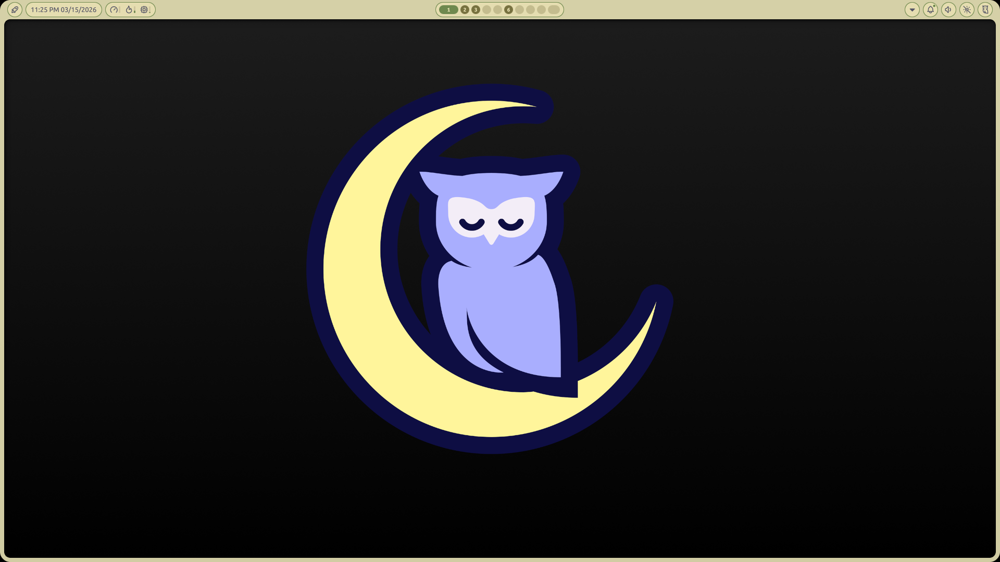

### App launcher

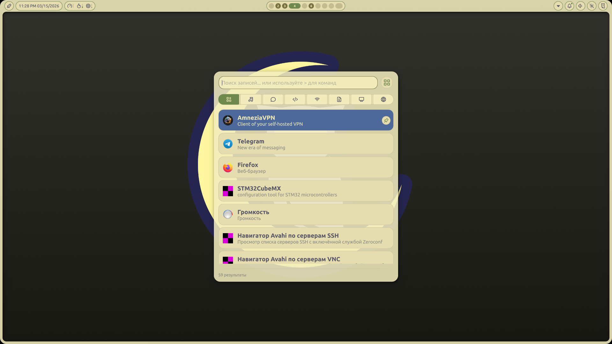

### Shutdown screen

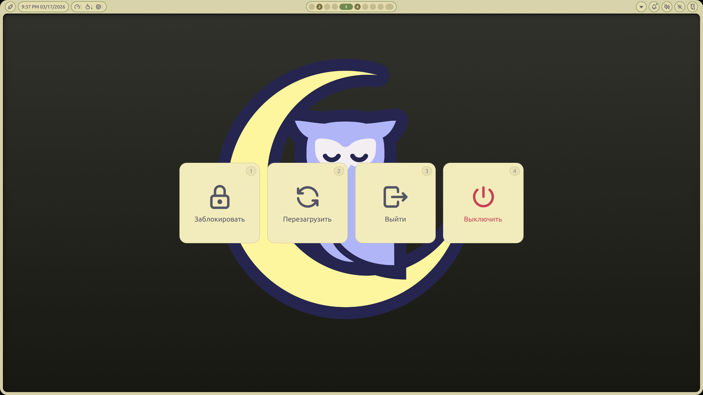

### Calendar


### Weather and settings

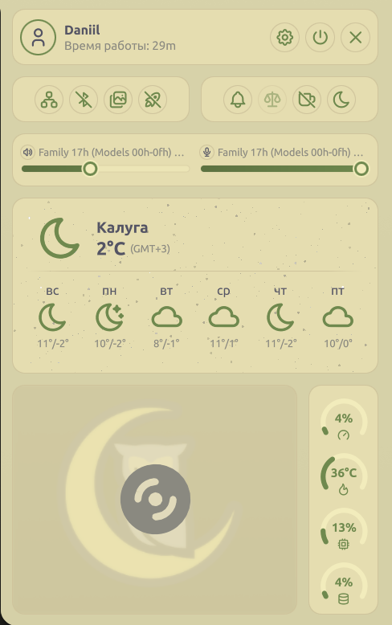

### Resource usage

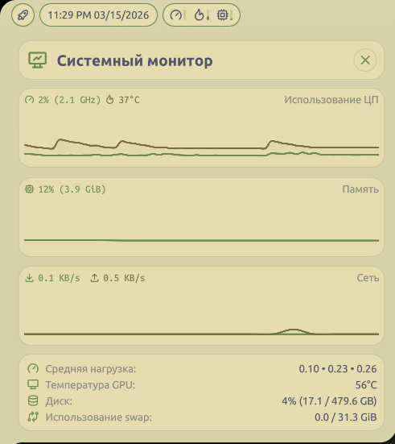

### `btop`

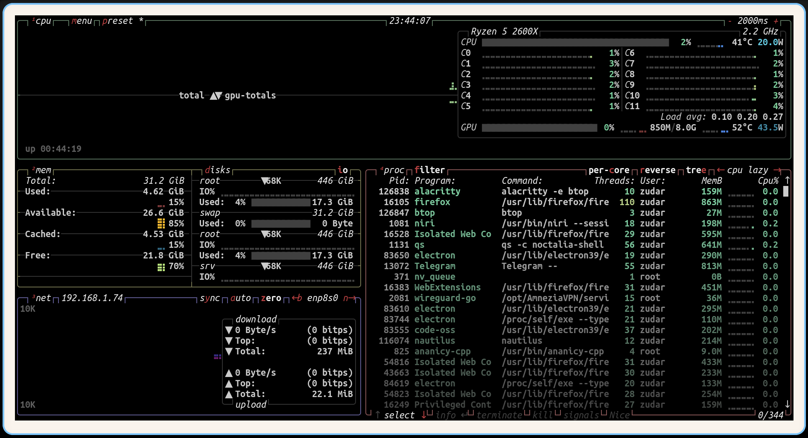

### Notifications

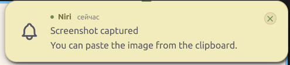

### Code - OSS

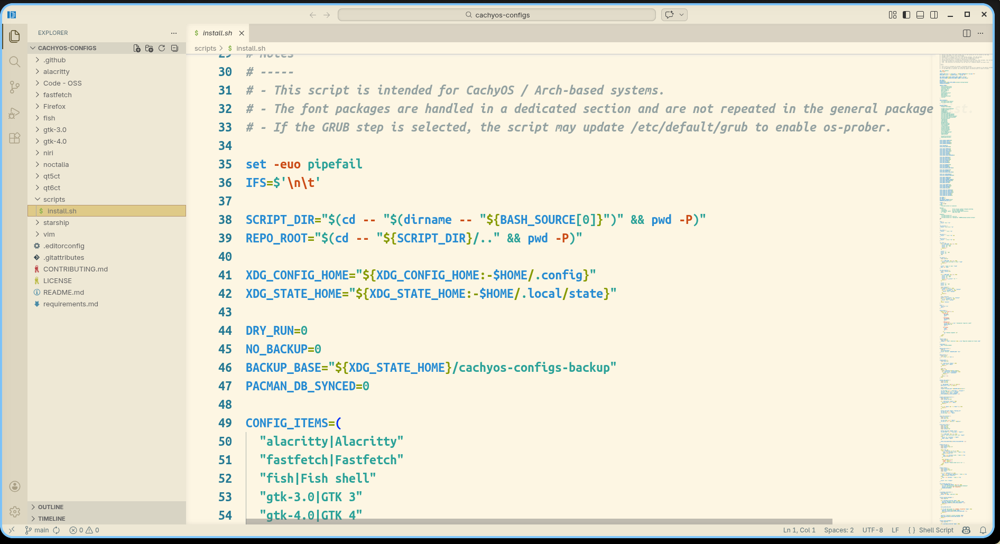

### Terminal

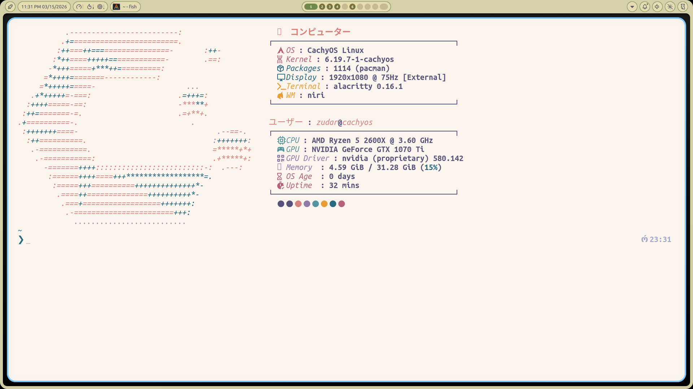

### Yazi — terminal file manager

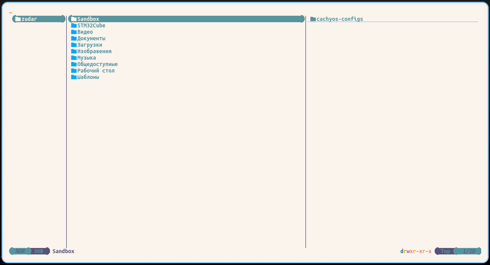

### Nautilus — GUI file manager

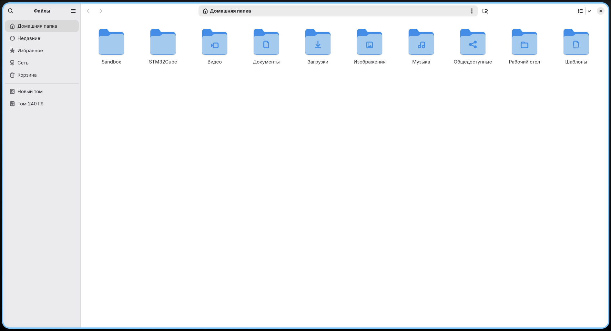

### Weathr — terminal weather

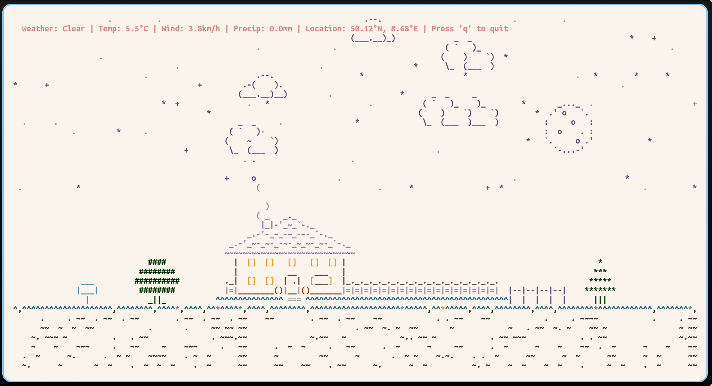

### Asciiquarium — a recurring feature at this point

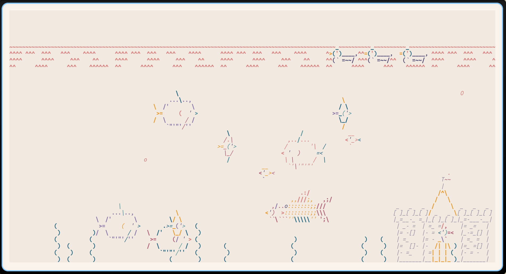

### My keybindings

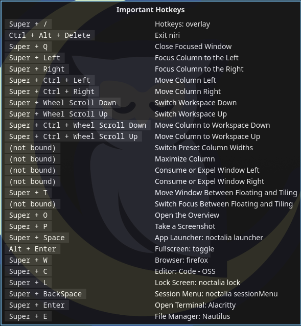

Yes, this is the kind of beauty we end up with. And this is exactly the kind of system you open not because you have to, but because **it is genuinely pleasant to use**.

---

## 🗂️ Where to tweak what in my configs

Below is a quick map of the main files, so you do not have to search for the right parameter by scientific trial and error.

* **`alacritty/alacritty.toml`** — Alacritty terminal settings: font, text size, colors, transparency, padding, window size, cursor behavior, scrolling, and terminal hotkeys.
* **`fish/config.fish`** — the main Fish config: aliases, abbreviations, `ssh-agent` startup, Starship initialization, `fzf`, and other useful things.
* **`fish/functions/`** — separate user-defined Fish functions: quick directory jumps, wrappers for `yazi`, `duf`, and more.
* **`fish/hyde_config.fish`** — base environment variables, especially XDG paths.
* **`starship/starship.toml`** — the look and content of the shell prompt: git branch, languages, command status, time, and everything else.
* **`fastfetch/config.jsonc`** — the `fastfetch` layout: what system information to show and how to show it.
* **`niri/config.kdl`** — the main entry point for the Niri config.
* **`niri/cfg/input.kdl`** — keyboard layouts, touchpad, mouse, NumLock, and input behavior.
* **`niri/cfg/keybinds.kdl`** — the main keybindings.
* **`niri/cfg/layout.kdl`** — gaps, column widths, layout behavior.
* **`niri/cfg/misc.kdl`** — environment variables for Wayland / Qt / Electron and other extra settings.
* **`noctalia/settings.json`** — Noctalia shell settings: panel, launcher, control center, notifications, widgets, wallpapers, and interface behavior.
* **`noctalia/colors.json`** — Noctalia color scheme.
* **`noctalia/plugins.json`** — Noctalia plugins.
* **`gtk-3.0/settings.ini`** and **`gtk-4.0/settings.ini`** — GTK app theme, icons, cursor, and base font.
* **`qt5ct/qt5ct.conf`** and **`qt6ct/qt6ct.conf`** — the appearance of Qt applications.
* **`Code - OSS/settings.jsonc`** — font, theme, editor behavior, terminal integration, and more.
* **`Code - OSS/extensions.txt`** — list of installed extensions.
* **`Firefox/user.js`** — Firefox user settings: privacy, telemetry, start page, PDF viewer, and more.
* **`Firefox/extensions.txt`** — list of Firefox extensions.
* **`vim/vimrc`** — the main Vim config.
* **`vim/hyde.vim`** — base Vim settings for the current environment.
* **`vim/colors/wallbash.vim`** — the color scheme in use.
* **`scripts/bootstrap.sh`** — the interactive initial setup script: packages, fonts, SSH/GPG, Git, config migration, and so on.

If you want to tweak the behavior of the window manager itself, you will almost always want to look at:

* `niri/cfg/keybinds.kdl`
* `niri/cfg/input.kdl`
* `niri/cfg/layout.kdl`

---

## ⌨️ Main hotkeys in my system

> **Mod** = Win / Super key.

### Launching apps

* **Mod + Return** — open Alacritty
* **Mod + W** — open Firefox
* **Mod + C** — open Code - OSS
* **Mod + E** — open Nautilus
* **Mod + Space** — open the app launcher

### System and windows

* **Mod + L** — lock the screen
* **Mod + Q** — close the window
* **Mod + F** — fullscreen
* **Mod + T** — floating mode
* **Mod + O** — open overview
* **Mod + Tab** — previous workspace

### Navigation

* **Mod + Left / Mod + H** — move left
* **Mod + Right** — move right
* **Mod + Up / Mod + K** — move up
* **Mod + Down / Mod + J** — move down
* **Mod + 1…9** — switch to workspace 1…9
* **Mod + Alt + 1…9** — move the window to workspace 1…9

### Screenshots and multimedia

* **Mod + P** — take a screenshot
* **XF86AudioRaiseVolume / XF86AudioLowerVolume** — volume up/down
* **XF86AudioMute** — mute audio
* **XF86AudioMicMute** — mute microphone
* **XF86AudioPlay / XF86AudioPause** — play / pause
* **XF86AudioNext / XF86AudioPrev** — next / previous track
* **XF86MonBrightnessUp / XF86MonBrightnessDown** — brightness

---

## 🔄 Updates and life after installation

Do not be shy about updating the system:

```bash
sudo pacman -Syu
```

And yes, I genuinely recommend doing this **regularly**.

So far, I have not run into any truly critical issues in CachyOS. And when I did find something odd, I usually solved it the same evening. Compared to my previous setup, that already sounds dangerously close to perfection.

---

## 🏁 Final thoughts

This is how we end up with a **friendlier system for normal users**, but without the feeling that all control over the machine has been taken away from us.

What we get in the end:

* a modern **Arch-based** system;
* a convenient GUI installer;
* a working **GRUB** setup;
* **Niri** as a pleasant and modern Wayland compositor;
* configured fonts, packages, configs, and a proper working environment;
* the ability to keep living without the constant urge to urgently fix something.

For me personally, **CachyOS** turned out to be exactly that point where you can still enjoy Linux — just without the constant ritual self-flagellation.

If you have questions, feel free to message me. If you find a bug in the configs, definitely message me. And if everything worked on the first try — congratulations, you are either very lucky, or you simply did everything carefully and did not try to break the system ahead of schedule 😄

Wishing you peace, fast mirrors, and working systems 🖤
