В прошлых частях мы настроили загрузочную флешку с Ventoy, которая может содержать несколько загрузочных файлов. И даже поставили  настроили Arch!! Отлично. Теперь пришло время чего-то нового. Настал следующий этап развития, и в этой статье я хочу поведать вам о другой операционной системе - CachyOS (https://cachyos.org). Это arch-based система, так что нам будет легко. Тем более она еще более юзер-френдли для обычного пользователя. Почему я решил перейти на нее? Потому что я устал разрешать конфликты HyDE и мириться с некоторыми неисправимыми багами. Так что сегодня снова пройдем путь настройки системы от начала и до конца. Данная статья обещает быть очень насыщенной!

Итак, сперва устанавливаем ISO с официального сайта (как обычно: важно ставить последнюю версию, иначе установщик будет ругаться). 

Закидываем на флешку с Ventoy. 
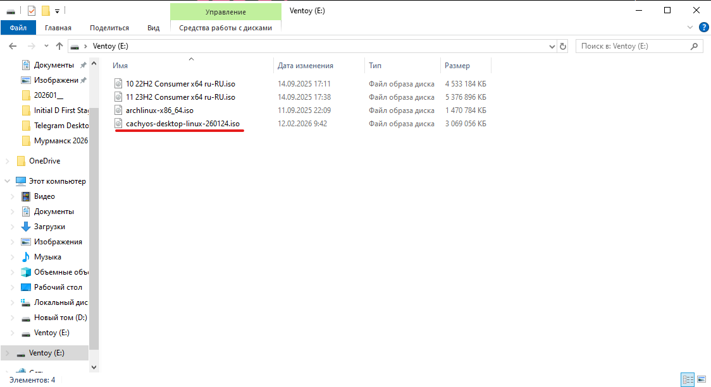

Далее очищаем диск, как и в прошлых частях. Останавливаться не буду.

Загружаемся с флешки. Снова настраиваем порядок загрузки в UEFI, ставим флешку на первое место. 

Далее запускаем установщик и (о боже!) получаем GUI-установщик, а не простую консоль!
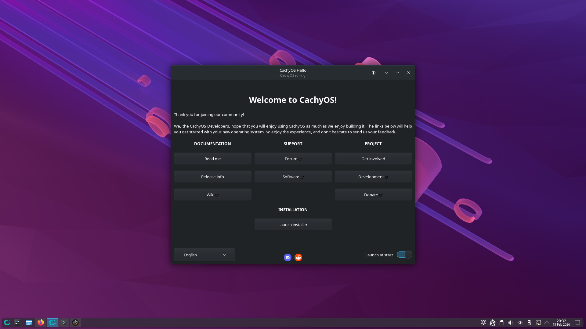

Нас приветствует максимальный юзер-френдли установщик! Тру линуксоиды, не осуждайте. Я выбрал быть счастливым. Да и консоль мы уже тыкали, можно и подняться на уровень выше. 

Далее начинаются проблемы... Самая глобальная: скрипт установки ранжирует зеркала (определяет самые близкие для загрузки). Но вот archlinux.gay почему-то попадает в этот список, хотя он не доступен.. Я много времени убил на это, в итоге исправил все туннелем на сервер. Вообще линукс в последнее время не обновляется без этого.

Чтоб вызвать консоль, стандартно CTRL + ALT + T
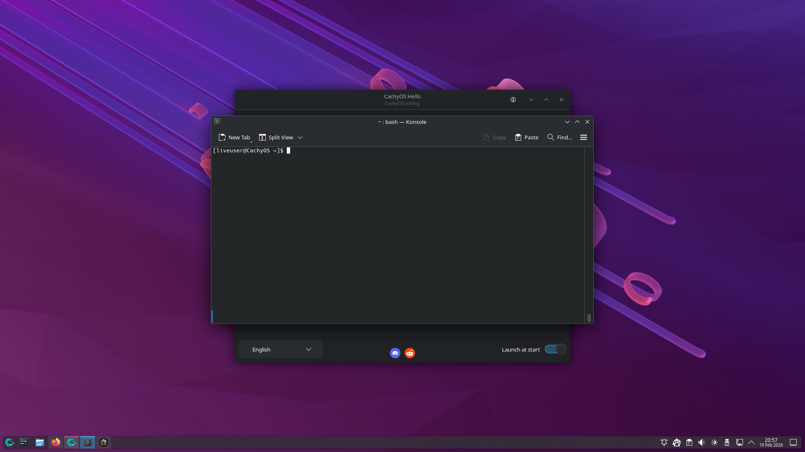

Если в дальнейшем при установке будет возникать ошибка с pacman, то перезагружаемся и сперва делаем это:

Ранжируем зеркала sudo cachyos-rate-mirrors

Далее удаляем из итогового списка проблемные зеркала. Сперва ищем, где встречаются: sudo grep -RInE '(archlinux\.gay|yandex)' /etc/pacman.d | head

Затем уже удаляем скриптом: 
for f in /etc/pacman.d/mirrorlist /etc/pacman.d/*mirrorlist*; do
  [ -f "$f" ] || continue
  if sudo grep -qE '(archlinux\.gay|yandex)' "$f"; then
    echo "Cleaning: $f"
    sudo cp -a "$f" "$f.bak"
    sudo sed -i -E '/archlinux\.gay/d;/yandex/d' "$f"
    sudo grep -nE '(archlinux\.gay|yandex)' "$f" || echo "  -> OK (no matches)"
  fi
done

Теперь можно обновить базы пакетов и поставить нужные из Росии:
sudo pacman -Syy

НО это поможет только, чтобы поставить пакеты в LiveCD. Потому что при запуске установщика, он снова запустит скрипт ранжирования зеркал, и в него попадут проблемные зеркала.

Так что прокидываем туннель на свой сервер (тут сами).

А затем уже можно будет устанавливать систему. Пройдемся по шагам установщика:

1) В этот раз язык поставлю русский и проверю, как система будет готова к такому. Раньше всегда сидел на английском, хочу попробовать что-то новое.

2) Запустить установщик

3) Язык русский
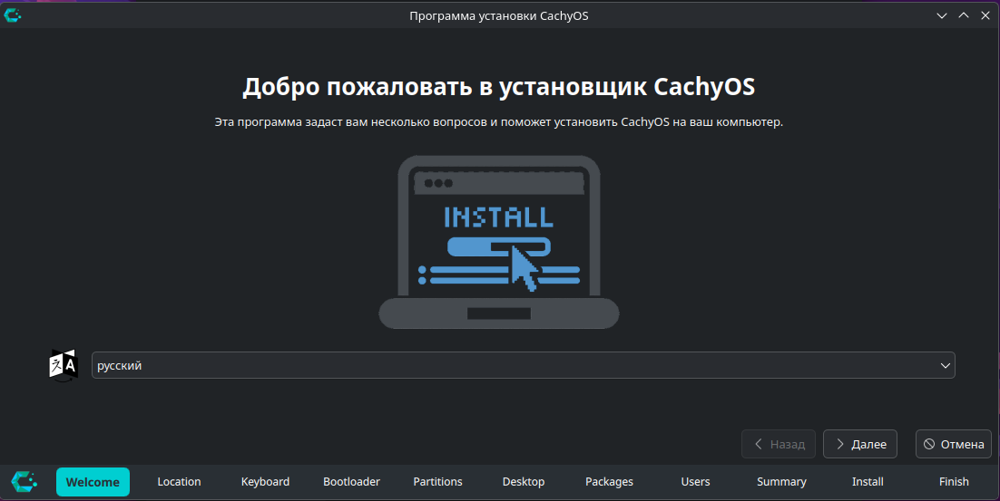


4) Location - Европа, Москва
Язык и формат чисел и дат будет установлен на русском.
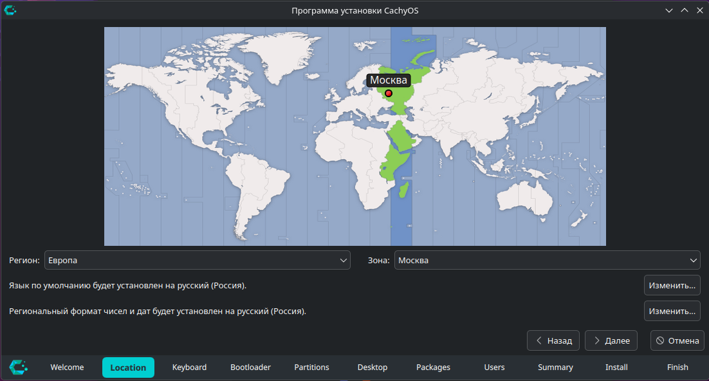

5) Настройки клавиатуры. Выбираю Русский язык и здесь, но по-моему не особо это помогло: пришлось все равно править конфиги.
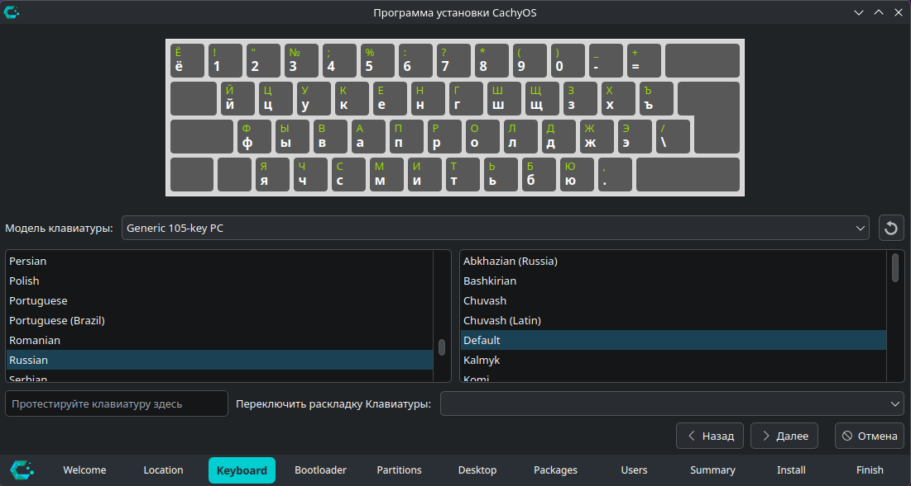

6) Далее выбираем загрузчик. GRUB проверен временем, берем его. systemd-boot я тыкал, но не смог настроить дуалбут, поэтому забил. Остальные не использовал.
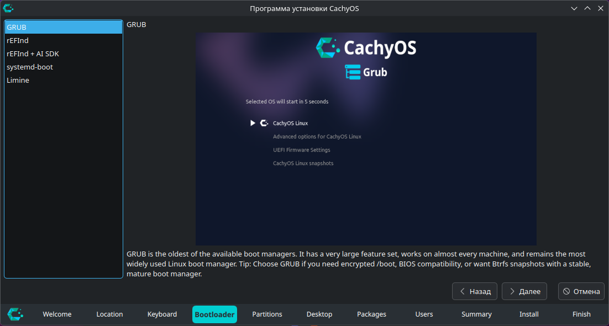

7) Далее разметка диска. Она примерно похожа на ту, что мы делали в прошлых статьях. Я ставлю на отдельный диск, так что все просто. Выбираю диск, который до этого очистил с Windows. Файловая система - все та же btrfs. При установке на один диск с Windows, скорее всего потребуется Manual partitioning. И разработчики предупреждают, что автоматическая разметка может плохо работать в таком случае, так что будьте осторожны.
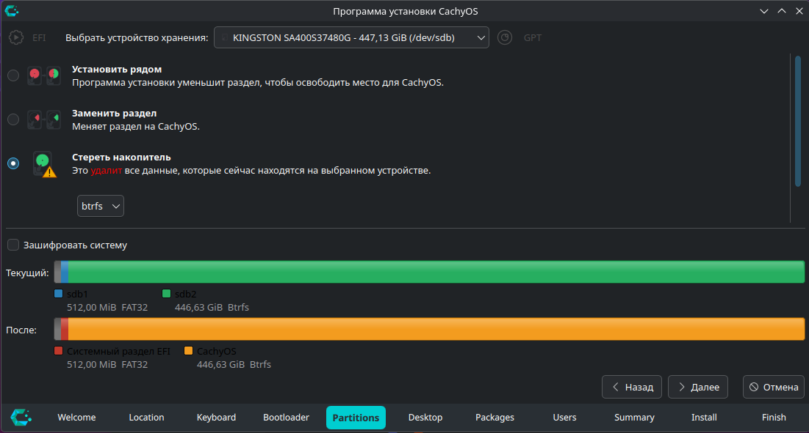

8) Далее выбираем Desktop Manager. Тут очень большой выбор. Хотите стабильности? Берите i3. Я сидел на нем довольно долго. Но для него проще поставить голый Arch и настроить. Будет работать на века. Но все-таки это устаревшие технологии (иксы). 
Hyprland у меня тоже был (на предыдущей системе). Надоел ломаться. 
Кеды, xfce, GNOME не обсуждаются, это отвратительное, тяжеловесное и некрасивое ПО.

В итоге, я остановился на выборе Niri. Меня завлек этот тайловый композитор. У него есть свои плюсы и минусы.
(расписать про нири)
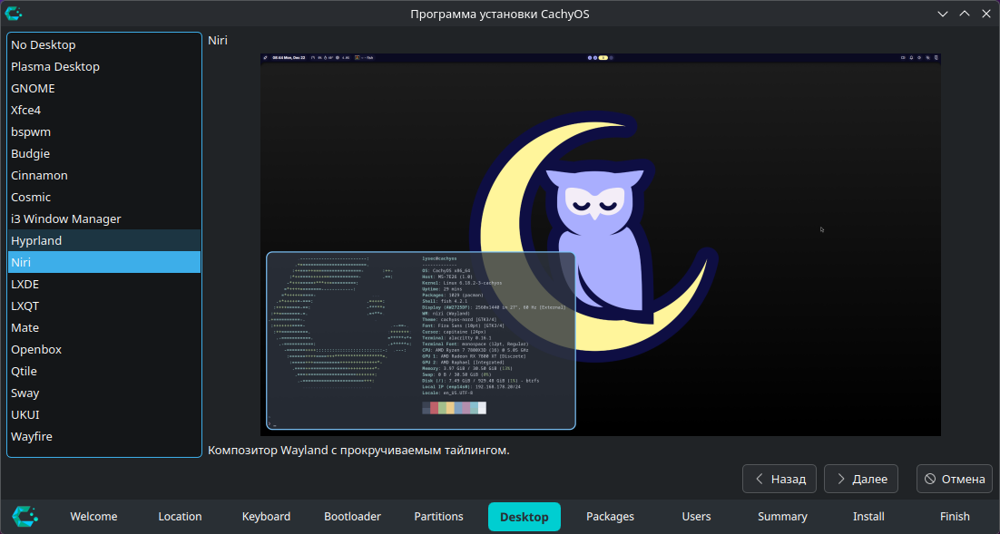

9) Список устанавливаемых пакетов. Можно доставить что-то для себя.
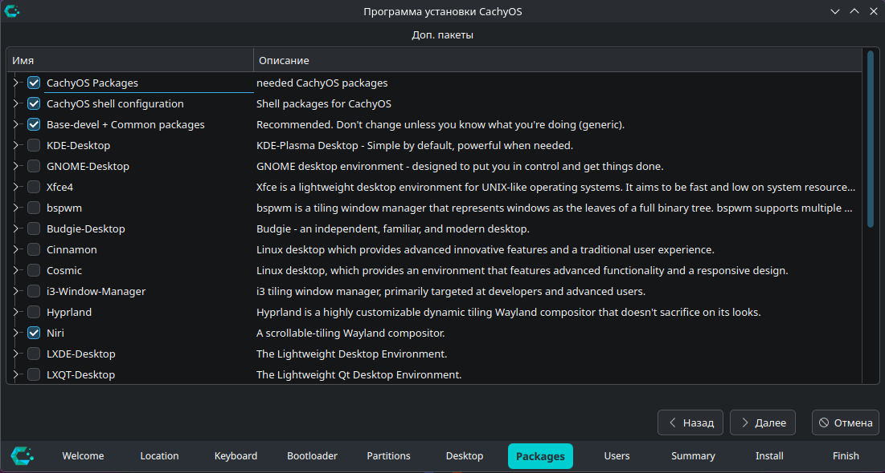

10) Создание пользователя
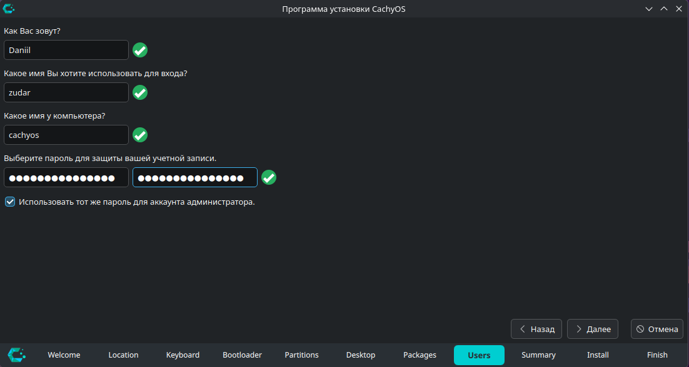

11) Итоги перед установкой. Проверьте тщательно.
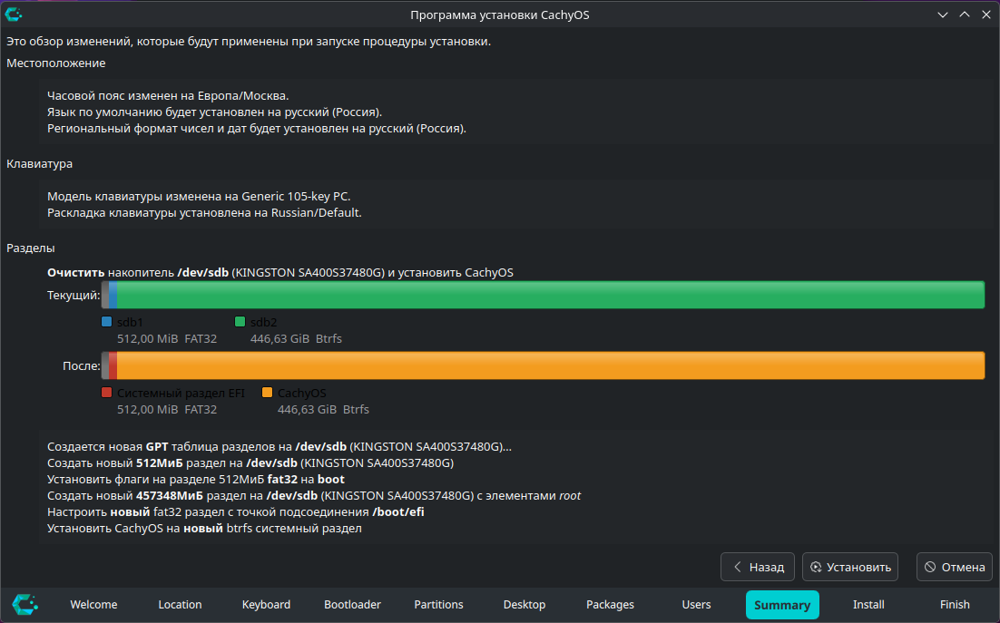

12) Установка. Все автоматизировано и должно работать исправно, если вы выполняли шаги, о которых я говорил :). В случае неудачи нужно смотреть логи и разбираться по факту. 
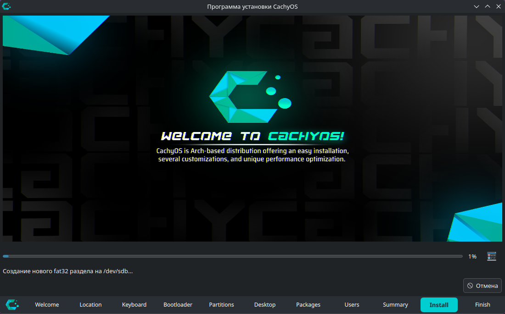
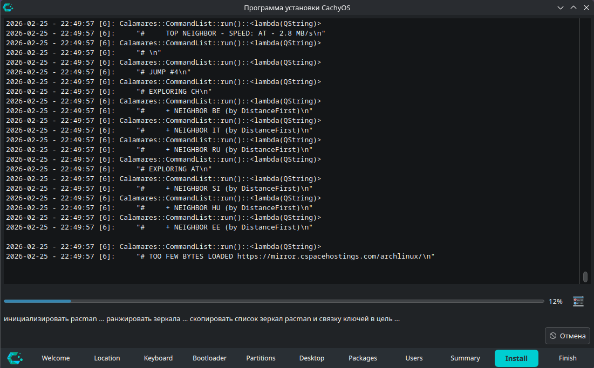

13) Установка занимает примерно 30 минут (все зависит от скорости интернета).
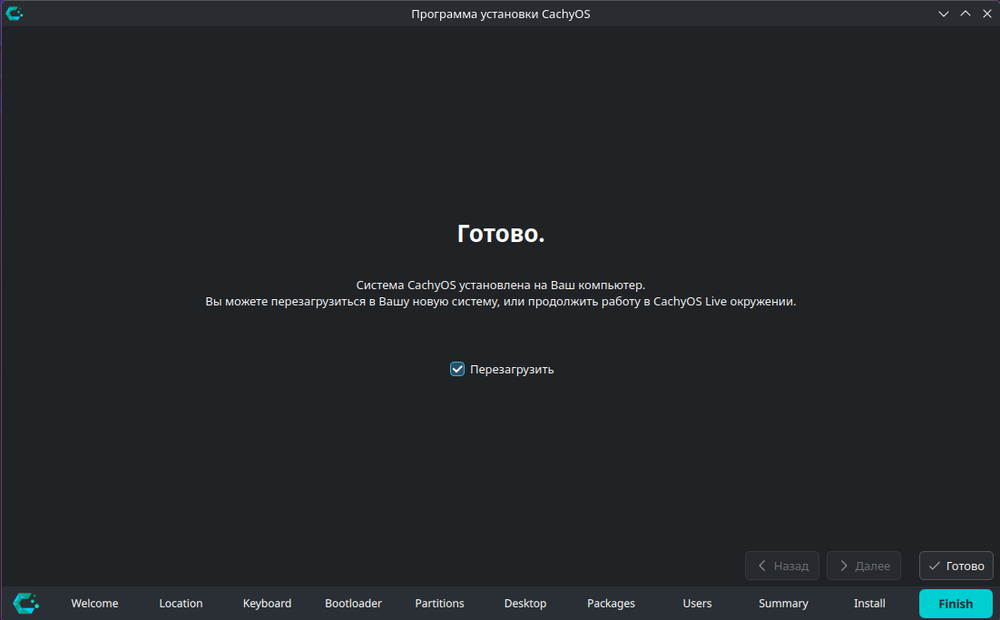

14) Далее перезагружаемся, выбираем в UEFI для загрузки GRUB и впервые входим в новую систему! Мне потребовалось несколько переустановок, чтобы система заработала исправно.

15) Нас сразу же приветствует базовая настройка системы. Собственно, включаем сбор статистики (поможем опенсоурсным бедолагам), выбираем директорию с обоями (пока она пустая), настраиваем цвета (я выбираю светлую и теплую тему - Kanagawa), далее настраиваем оформление основных элементов интерфейса. 
(несколько фоток стартовых настроек)

В целом, всегда можно изменить настройки справа сверху в панели. Или просто скопировать мои в дальнейшем из репозитория конфигов.

16) Идем на https://github.com/zudaR107/cachyos-configs
Я специально подготовил и уже выпустил в релиз репозиторий с моими конфигами CachyOS.

Стягиваем их себе. Тут есть скрипт автоматической установки конфигов и тотальной настройки системы:
cd cachyos-configs
./scripts/install.sh --help - помощь
./scripts/install.sh --dry-run - посмотреть, что будет
./scripts/install.sh --backup-dir <path> - переопределить путь для сохранения текущих конфигов

Если есть ошибки, попробуйте исправить их сами. И напишите мне, чтобы я обновил конфиги.


17) Но если Вы хотите настроить систему самостоятельно, то сейчас я продублирую все шаги из скрипта. Открываем консоль (CMD + Return), ранжируем зеркала, обновляем систему и ставим нужные нам пакеты с помощью pacman и yay:
sudo pacman -Suyy - обновить базу данных всех пакетов системы и сами пакеты
Теперь я стал обновлять систему каждый день и перестал бояться конфликтов. Rolling release!
sudo pacman -S <имя_пакета> - установить пакет
sudo pacman -Ss <имя_пакета> - найти пакет
yay <имя_пакета> - найти и выбрать пакет для установки
По возможности, ставим пакеты из репозиториев cachyos-, потому что там они обычно новее, чем в дефолтной extra.

Мой список необходимых пакетов:
1) telegram-desktop
2) yay
3) lazygit
4) zip
5) unzip
6) unarchiver
7) arm-none-eabi-gcc
8) arm-none-eabi-gdb
9) arm-none-eabi-binutils
10) arm-none-eabi-newlib
11) qtcreator
12) lldb
13) code
14) yazi
15) onlyoffice-bin
16) gnupg
17) pinentry
18) starship
19) ttf-ubuntu-font-family
20) ttf-ubuntu-mono-nerd
21) rsync
22) cliphist
23) wlsunset
24) onefetch
25) fastfetch
26) stlink
27) ******
28) ex-vi-compat
29) neovim
30) pwgen
31) bear
32) picocom
33) openocd

34) onlyoffice-bin
30) jlink
31) stm32cubemx
32) stm32cubeprog
33) stm32cubeide
34) 

Не стесняемся поглядывать документацию на любую команду:
man <команда> или
<команда> --help

18) Ставим шрифты Ubuntu Mono
sudo pacman -Sy --needed ttf-ubuntu-font-family ttf-ubuntu-mono-nerd
fc-cache -f Обновить кэш
fc-list | grep -i "Ubuntu Mono" | head Проверить наличие шрифтов в системе

19) Далее сделаем дуалбут. Для этого нужно воспользоваться os-prober, чтобы определить загрузочный диск Windows. 
Сперва глянем, что Windows Boot Manager реально есть:
sudo efibootmgr -v | grep -i "Windows" -n || true
Далее правим /etc/default/grub:
добавь/раскомментируй строку
GRUB_DISABLE_OS_PROBER=false
Проверяем, что os-prober видит Windows:
sudo os-prober
И пересобираем конфиг GRUB:
sudo grub-mkconfig -o /boot/grub/grub.cfg
Далее перезагружаемся и в GRUB должен появиться пункт Windows.

20) Далее настроим SSH и GPG ключи для системы.
SSH - это (написать)
ed25519
Создаем ключ:
ssh-keygen -t ed25519 -C "your_email@example.com"
Далее можно добавить ключ в агент (делать в bash):
eval "$(ssh-agent -s)"
ssh-add ~/.ssh/id_ed25519_github
Но я настраивал конфиги так, чтобы ключ автоматически добавлялся в агент после первого использования и до перезапуска сессии терминала.
Далее публичную часть ключа мы можем получить из файла:
cat ~/.ssh/id_ed25519.pub
Она и используется для прокидывания на другие сервера или Github
Правим конфиг подключений SSH (~/.ssh/config):
```
Host *
  ServerAliveInterval 30
  ServerAliveCountMax 3
  TCPKeepAlive yes
  AddKeysToAgent yes
  IdentitiesOnly yes
  HashKnownHosts yes
  StrictHostKeyChecking ask
  IdentityAgent $SSH_AUTH_SOCK

Host github.com
  HostName github.com
  User git
  IdentityFile ~/.ssh/id_ed25519

Host myvps
  HostName your.server.domain_or_ip
  User your_user
  Port 22
  IdentityFile ~/.ssh/id_ed25519
```
Проверка: ssh -T git@github.com

Теперь создадим GPG:
GPG - это (написать)
Создаем ключ:
gpg --full-generate-key
Рекомендованные ответы:
ECC (только для подписи)
Curve 25519
Срок действия любой. Я ставлю на год.
Далее вводим имя, почту и пароль.
Чтобы использовать, смотрим ключ:
gpg --list-secret-keys --keyid-format=long
gpg --armor --export AAAAAAAAAAAAAAAA

Правим конфиг (~/.gnupg/gpg-agent.conf):
```
pinentry-program /usr/bin/pinentry-curses
default-cache-ttl 2147483647
max-cache-ttl 2147483647
```
Таким образом, ключ будет жить максимально возможное время (на самом деле до перезапуска терминала)
Перезапуск агента:
gpgconf --kill gpg-agent
gpgconf --launch gpg-agent

После прокидывания ключа на гитхаб, указываем настройки:
git config --global user.name "Ваше Имя"
git config --global user.email "[email protected]"
git config --global user.signingkey AAAAAAAAAAAAAAAA
git config --global commit.gpgsign true
git config --global tag.gpgsign true
git config --global gpg.program gpg

Проверяем gpg-ключ: создаем любой коммит и смотрим

Написать, какая стратегия хранения ключей лучше (один ключ на одно локальное устройство. Сервер хранит несколько таких ключей. Один ключ под разные серверы, если сервер не сильно важен).

21) В итоге у нас получается полностью настроенная система. Вы только посмотрите на эту красоту:
(скрины системы)
