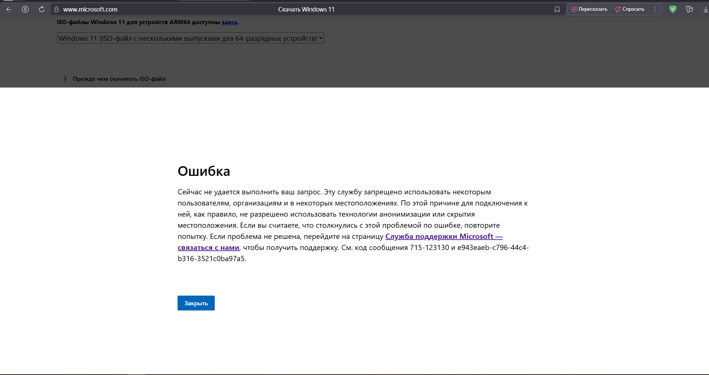
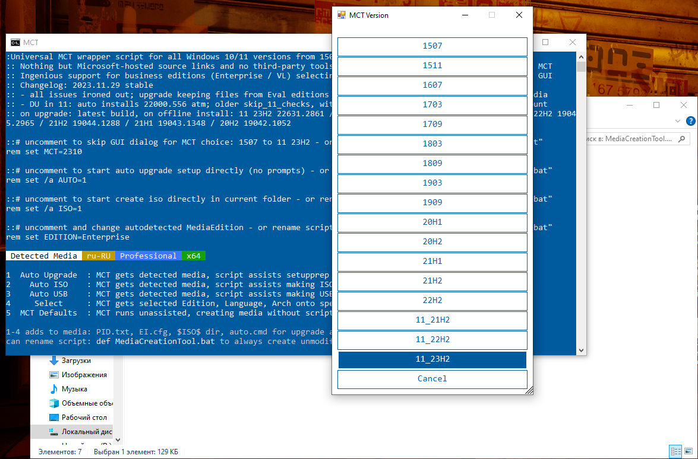
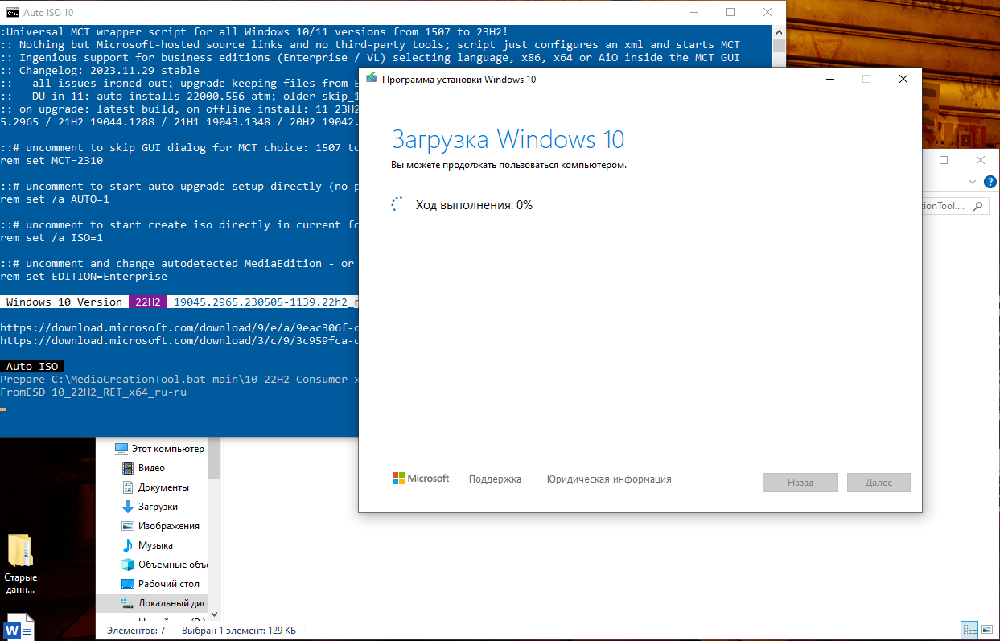
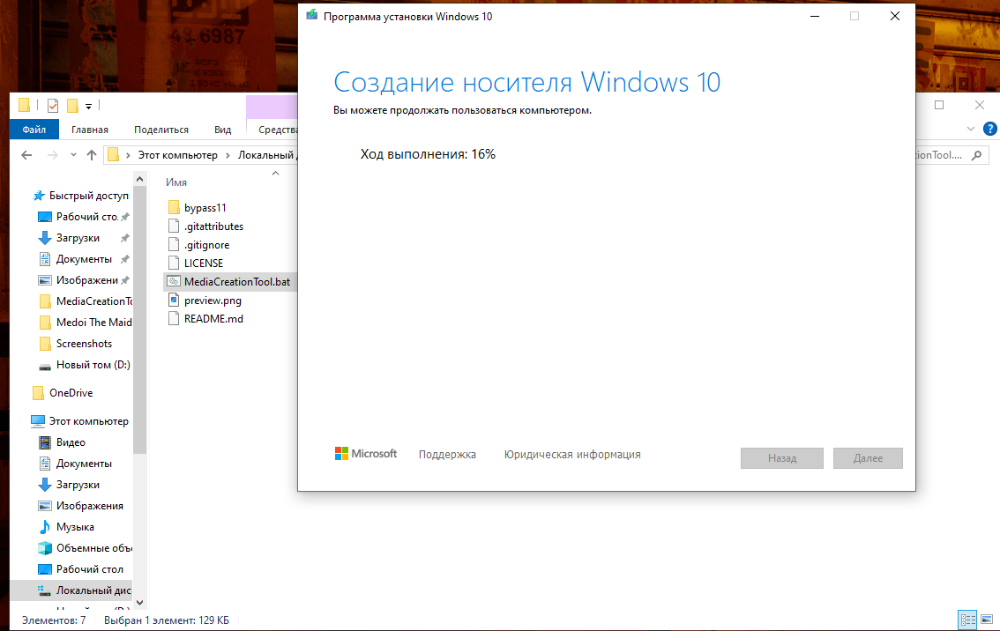
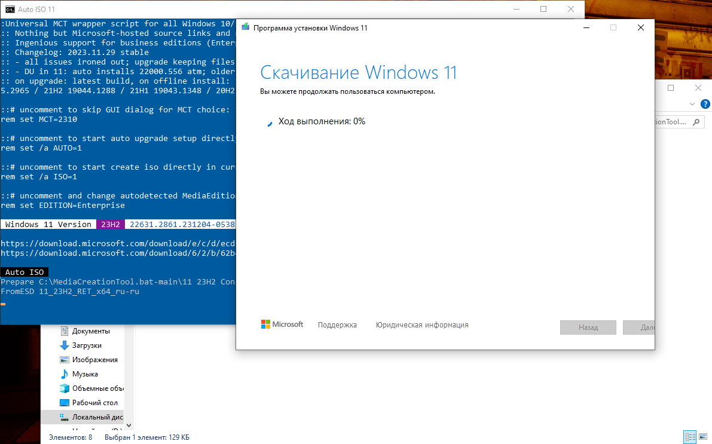
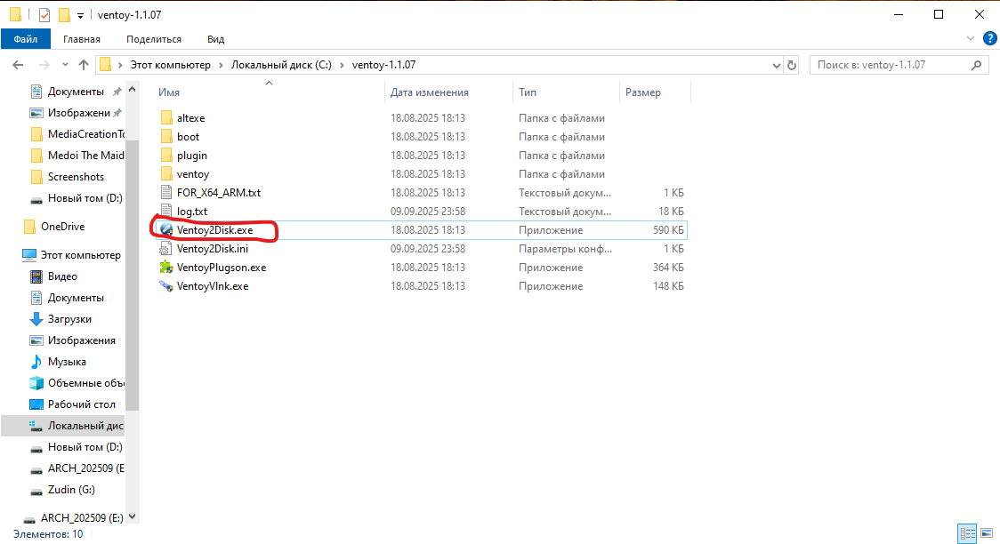
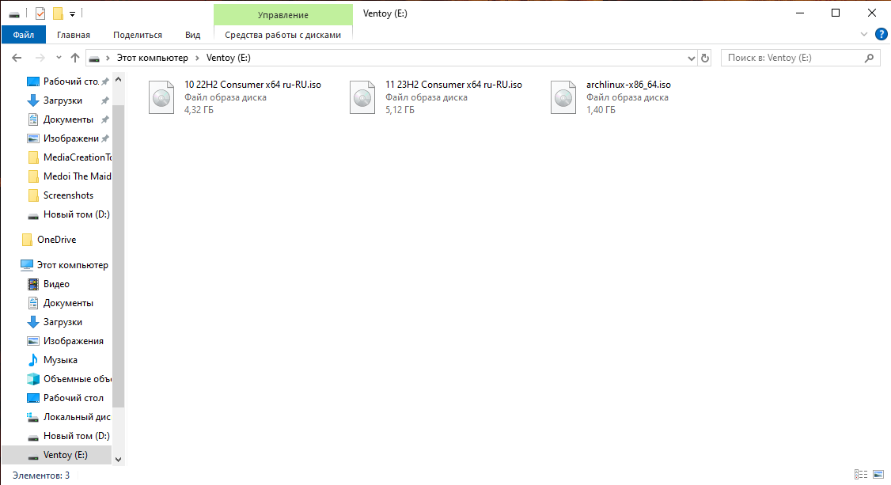
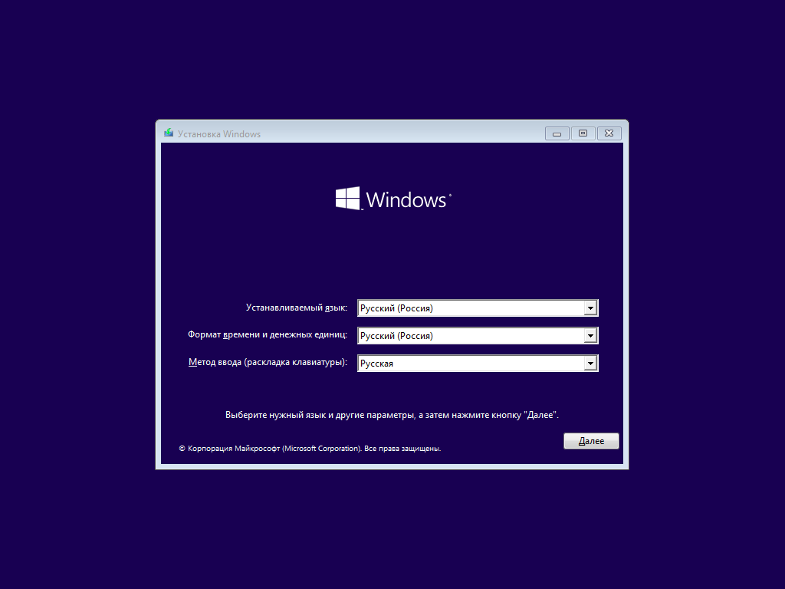
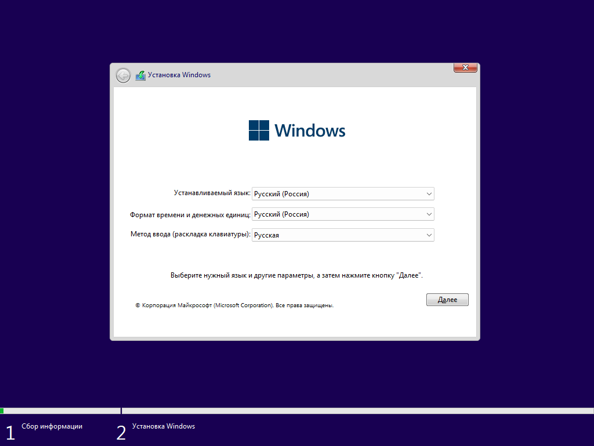

# Operating Systems. Part 2 — “Ventoy” 🚀

In the previous article we made a bootable USB, plugged it into a colleague’s PC, and slightly shook their belief in “GUI only, nothing else” 😏

Alright, let’s be nice and give them Windows back. But we’ll do it **properly**: not one OS per drive, but **Ventoy** with a bunch of ISOs on a single stick. I mean, dedicating 64 GB to one image (that’s < 2 GB anyway) is kinda lame 🙃

**Ventoy** is a free, open‑source tool that makes a USB drive bootable so you can just copy **ISO / WIM / IMG / VHD(x) / EFI** files onto it and pick one from a menu. Chef’s kiss ❤️

---

## Plan

1. **Hop into Windows and grab our USB stick.**

      Format it as usual. Nothing fancy here.

2. **We already have the Arch Linux ISO** from the previous article.

      If not — download it first. (And yes, the **Arch Wiki** is sacred 🔥)

3. **Get Windows ISOs.**

      And here come the hoops… Since around 2022, Microsoft limited direct ISO downloads for some regions. So “just from the site” doesn’t work — even with those three magic letters 😑

      

      Torrents? Not a fan (don’t fully trust even rutracker for this) — too much junk. Let’s use an official route instead.

4. **Media Creation Tool — our savior.**

      It’s Microsoft’s own utility that prepares Windows 10/11 install media directly from their servers and without a product key. The tool itself might be geo‑restricted — GitHub to the rescue:

      👉 Repo: [https://github.com/AveYo/MediaCreationTool.bat](https://github.com/AveYo/MediaCreationTool.bat)

      Click **Code → Download ZIP**, grab the archive and unpack it anywhere.

      

      > ⚠️ You may need those *three letters* (you know which). There won’t be a guide on that — current realities and all that. Whether the batch works for you without them — try and see.

5. **Run the script.**

      Open `MediaCreationTool.bat` from the extracted folder.

      

6. **Windows 10:** pick **22H2** — still the most stable and comfy in my book. Shame support isn’t forever 🥲

      

7. **Hit Auto ISO.**

      The script will start downloading automatically into a standard folder (usually drive `C:`) if you ran it straight from the archive; otherwise into the extracted folder. Just wait… ⏳

      

      

      

8. **Windows 11:** same dance. Run the script again, choose the latest `11_23H2` → **Auto ISO** → wait.

      

      

9. **Microsoft ISO recap.**

      We end up with **two ISOs** on disk: Windows 10 (22H2) and Windows 11 (23H2).

      

      Took about **30 minutes** for both here. Your mileage may vary — bandwidth roulette ⚡

10. **Grab Ventoy.**

      Now we have **three ISOs**: Arch Linux, Windows 10 22H2, and Windows 11 23H2.

      Time for Ventoy: 👉 [https://ventoy.net](https://ventoy.net)

      Go to **Downloads**, fetch the ZIP, unpack it.

11. **Run `Ventoy2Disk.exe`.**

      

12. **Pick the right USB drive** → hit **Install** → wait.

      

      > ⚠️ Important: Ventoy will **repartition** the device. Everything on it will be gone. Triple‑check the **correct drive letter**. Don’t be like me 🤡

13. **Verify the installation.**

      After installation the drive label will be **Ventoy** — that’s your green light ✅

      

14. **Copy ISOs onto the USB.**

      **Copy all three ISOs to the USB.** Just drag & drop — no “write image” wizardry or other rituals.

      

      Took another ~30 minutes 🙂 Note the total size — Windows ISOs are *chonky*.

15. **Boot with Ventoy.**

      **Reboot and boot from the USB** (see last article for picking the Boot Menu). You’ll see Ventoy’s menu:

      

      Sorry — taking a proper screenshot here is basically impossible `¯\_(ツ)_/¯`

16. **Test‑boot each image.**

      **Arch Linux:**

      

      **Windows 10 22H2:**

      

      **Windows 11 23H2:**

      

      Everything launches — beautiful! 🎯

---

## Result

Now we’ve got a **universal USB**: install Linux, restore Windows, and look like someone who plans ahead 😉

Ventoy is something I carry with me all the time.

You can toss more distros on it (say, Debian) — always nice to have options.

**Cheers!** Arch Linux installation — in the next article 🖤🐧
