# Операционные системы. Часть 2 — «Ventoy» 🚀

В прошлой статье мы сделали загрузочную флешку, успешно воткнули её в комп коллеге и слегка подорвали его веру в «только GUI и ничего больше» 😏

Но ладно, пора и совесть включить — вернём человеку «винду». И сделаем это красиво: не одна система на весь носитель, а **Ventoy** с кучей ISO на одной флешке. Ну серьёзно, занимать 64 ГБ одним образом (да ещё и < 2 ГБ) — несолидно 🙃

**Ventoy** — бесплатная утилита с открытым исходным кодом, которая делает USB‑накопитель загрузочным так, что вы просто копируете на него **ISO / WIM / IMG / VHD(x) / EFI**‑файлы, а потом выбираете нужный в меню. Красота ❤️

---

## План действий

1. **Идём в Windows и берём нашу флешку.**
   Форматируем как обычно. Тут ничего нового.

2. **ISO Arch Linux** у нас уже есть с прошлой статьи.
   Если нет — скачайте заранее. (И да, **Arch Wiki** — это святое 🔥)

3. **Достать ISO Windows.**
   И вот тут начинаются пляски… Примерно с 2022 года Microsoft ограничила скачивание образов для жителей нашей великой державы. Поэтому «просто с сайта» — не прокатывает даже с использованием трех букв 😑

   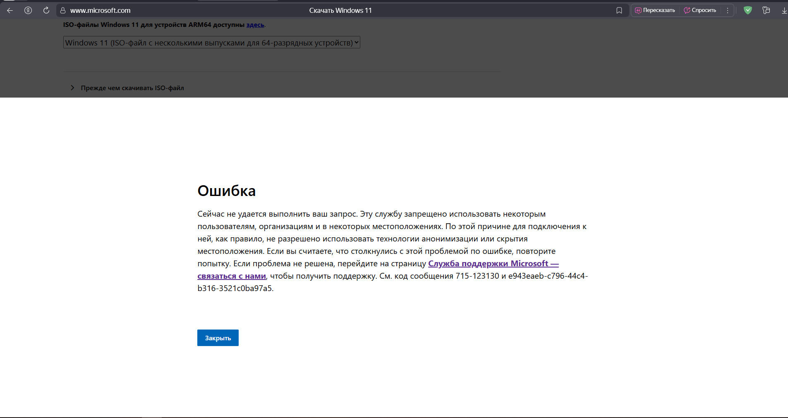

   Качать с торрентов? Я не фанат (даже рутрекеру тут не доверяю) — слишком много мусора. Ищем официальный способ.

4. **Media Creation Tool — наше всё.**
   Это фирменная утилита от Microsoft, которая готовит загрузочные образы Windows 10/11 напрямую с их серверов и без ключа продукта. Но сама по себе она тоже недоступна в нашей стране. Выручают ребята с GitHub:

   👉 Репозиторий: [https://github.com/AveYo/MediaCreationTool.bat](https://github.com/AveYo/MediaCreationTool.bat)

   Нажимаем **Code → Download ZIP**, скачиваем архив и распаковываем куда удобно.

   

   > ⚠️ Дальше по-хорошему пригодятся «три буквы» (вы поняли какие). Гайда по ним **не будет** — современные реалии такие. Работает ли батник без них именно у вас — проверяйте.

5. **Запускаем скрипт.**
   Открываем `MediaCreationTool.bat` из распакованной папки.

   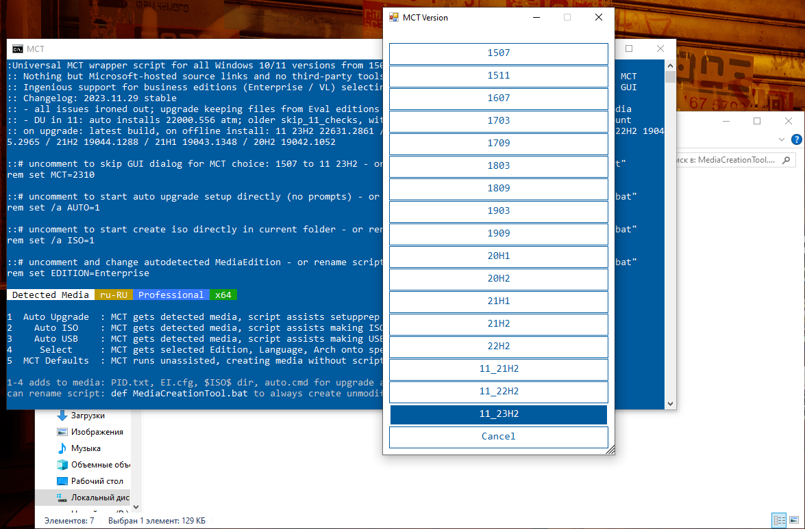

6. **Windows 10:** выбираем **22H2** — она до сих пор максимально стабильная и удобная, как по мне. Эх, жаль, что поддержка не вечна 🥲

   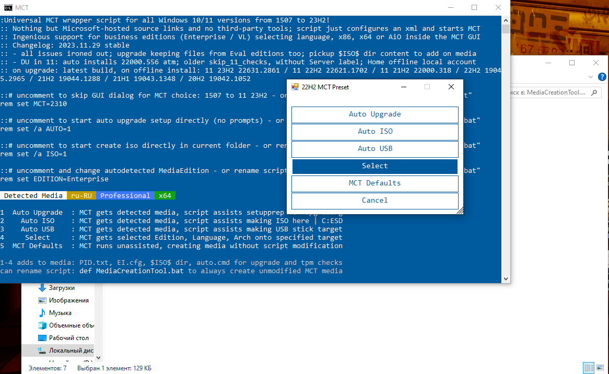

7. Жмём **Auto ISO**. Скрипт сам запустит скачивание в стандартную папку (обычно диск `C:`), если вы запускали его прямо из архива; либо внутрь распакованной папки. Просто ждём… ⏳

   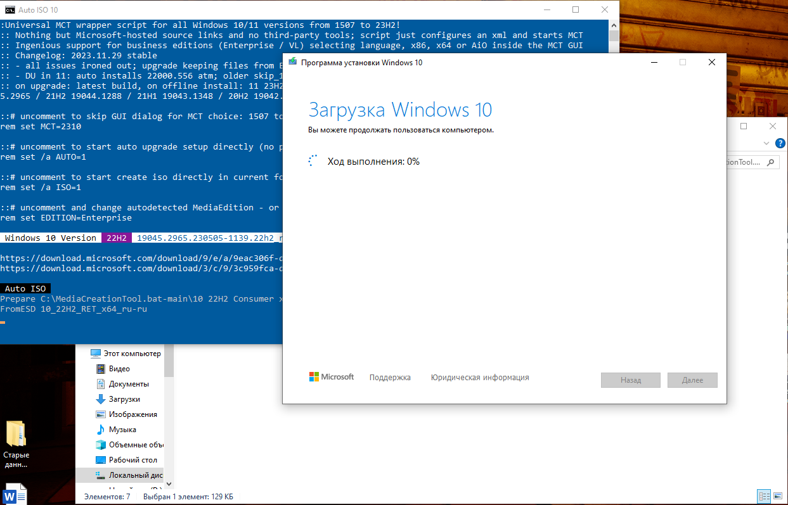

   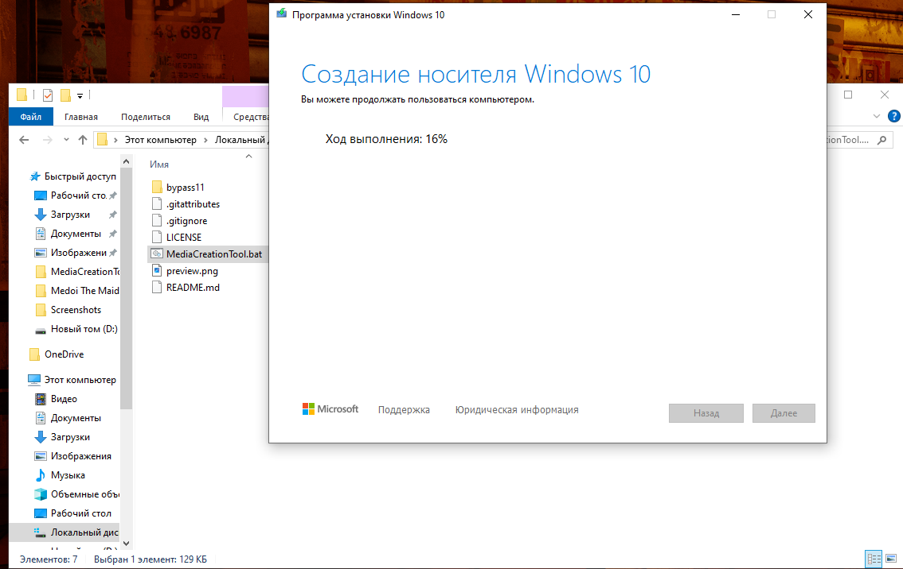

   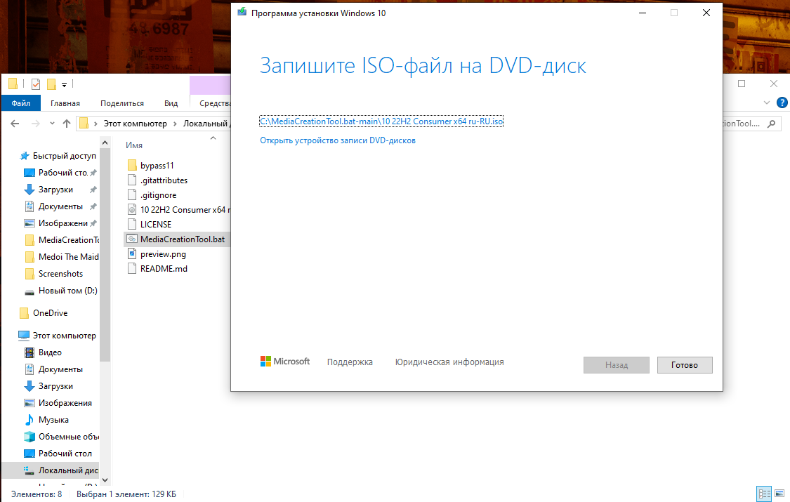

8. **Windows 11:** делаем аналогично. Снова запускаем скрипт и выбираем последнюю **11\_23H2** → **Auto ISO** → ждём.

   

   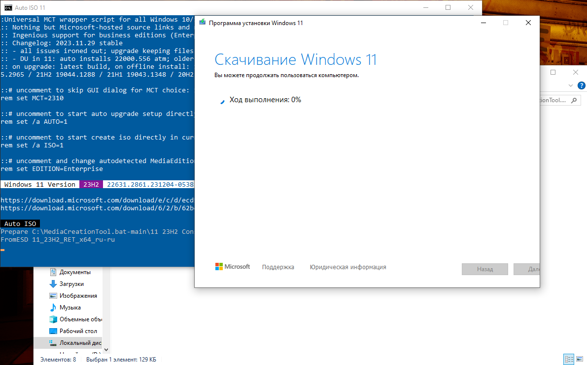

9. В итоге у нас на диске лежат **два ISO**: Windows 10 (22H2) и Windows 11 (23H2).
   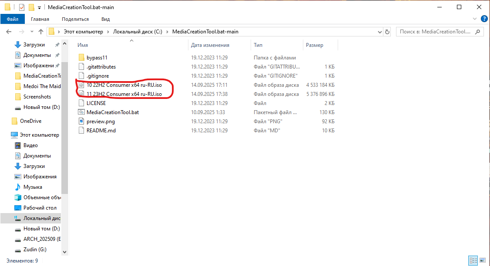

   По времени это заняло около **30 минут** (оба образа). У вас может быть быстрее/дольше — как повезёт с каналом ⚡

10. Теперь у нас есть **три ISO**: Arch Linux, Windows 10 22H2 и Windows 11 23H2. 

    Пора за Ventoy: 👉 [https://ventoy.net](https://ventoy.net)

    Заходим в **Downloads**, скачиваем ZIP‑архив, распаковываем.

11. **Запускаем `Ventoy2Disk.exe`.**

    

12. **Выбираем нужную флешку** → жмём **Install** → ждём.

    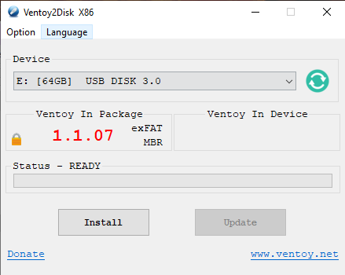

    > ⚠️ Важно: Ventoy **переразобьёт** носитель под себя. Всё, что было на флешке, улетит в космос. Проверьте, что выбрана **правильная** буква диска. Не будьте как я 🤡

13. После установки флешка будет подписана как **Ventoy** — значит всё ок ✅

    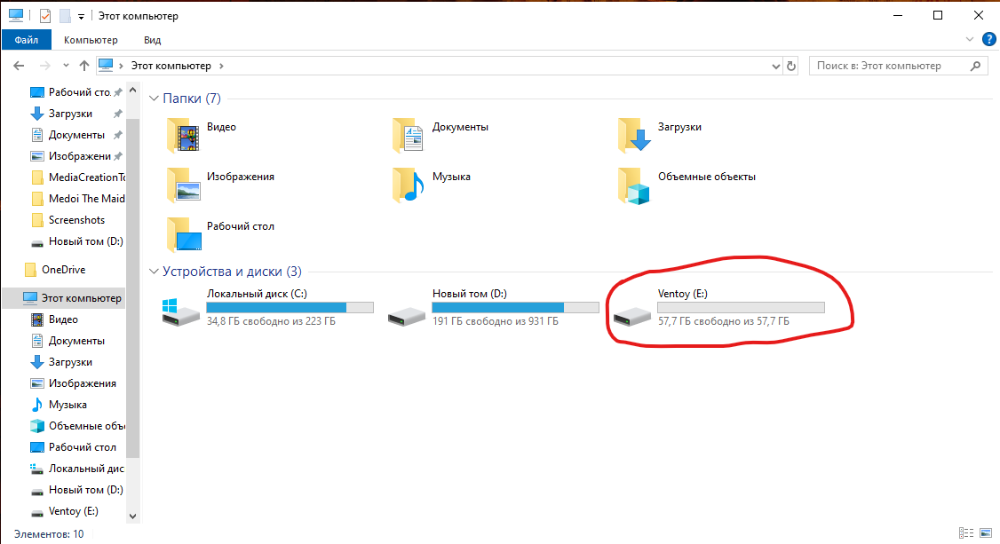

14. **Копируем все три ISO на флешку.** Просто перетаскиваем файлы — никаких «записей образов», «магии» и прочего шаманства.

    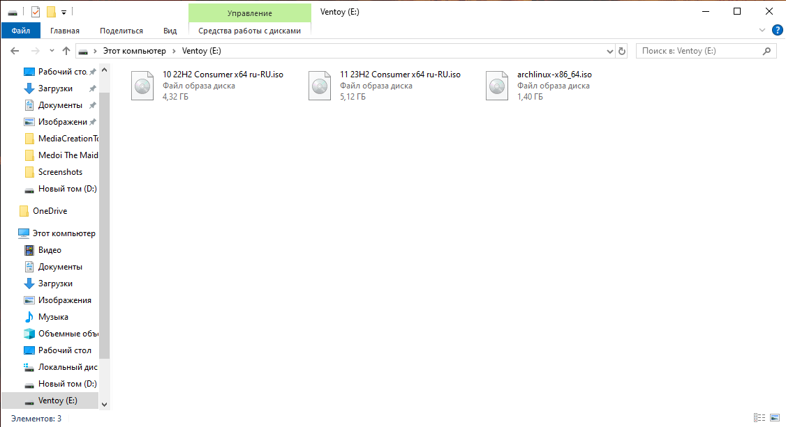

    Это заняло ещё минут 30 🙂 Обратите внимание на общий объём — ISO‑шники винды оочень толстые.

15. **Перезагружаемся и грузимся с флешки** (см. прошлую статью про выбор Boot Menu).
    Перед нами меню Ventoy:

    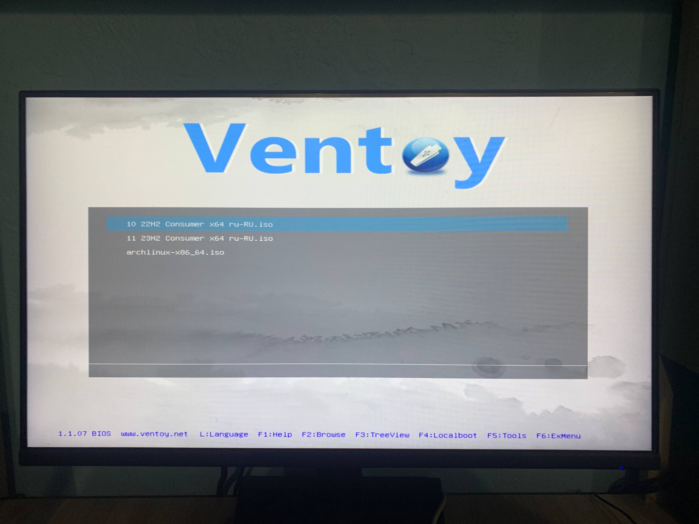

    Тут уж извините — скриншот нормально сделать нельзя ¯\\*(ツ)*/¯

16. **Тестируем запуск каждого образа.**

    **Arch Linux:**

    

    **Windows 10 22H2:**

    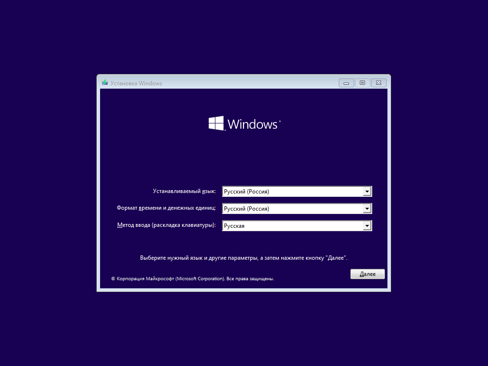

    **Windows 11 23H2:**

    

    Всё стартует — красота! 🎯

---

## Что в итоге

Теперь у нас **универсальная флешка**: и Linux поставить, и «винду» вернуть, и вообще выглядеть как человек, который думает на шаг вперёд 😉
Ventoy — вещь, которую я таскаю с собой всегда. 
Еще можно закинуть на неё других дистрибутивов (например, Debian) — пусть будет богатый выбор.

**Всем добра!** Установка Arch Linux — в следующей статье 🖤🐧
